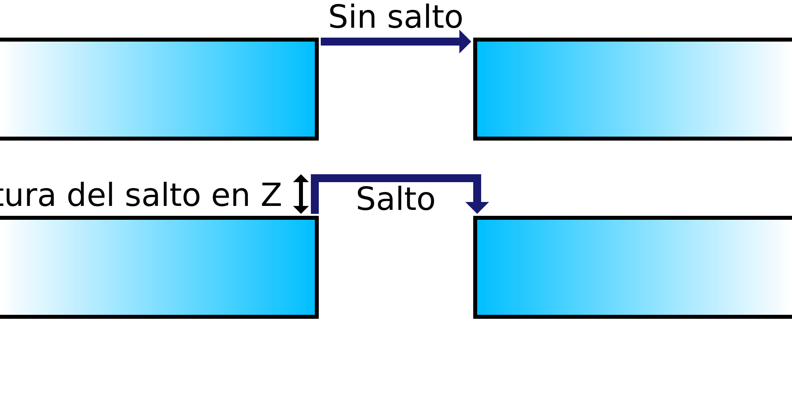

Salto en Z en la retracción
====
Si este ajuste está activado, la boquilla se elevará por encima de la impresión ligeramente cuando la boquilla tenga que desplazarse de un lugar a otro. El objetivo de esto es que la boquilla pase por encima de la impresión en lugar de golpear con la boquilla las partes previamente impresas.

Cada vez que se realiza una retracción, la boquilla se eleva (o la placa de construcción se baja) para crear un espacio libre entre la boquilla y la impresión. Esto tiene varias ventajas:
* Evita que la boquilla golpee la impresión durante los movimientos de desplazamiento. Cuando la boquilla golpea la impresión deja una cicatriz visible, por lo que debería mejorar la calidad visual de las paredes de la impresión.
* Si el material rezuma de la boquilla durante los movimientos de desplazamiento, el exudado se deposita donde la boquilla cae después del movimiento de desplazamiento, que es a menudo en el relleno donde no es visible. Esto reduce las manchas en la superficie.
* Las manchas en la superficie tienen la posibilidad de derribar su impresión, por lo que habilitar este ajuste puede mejorar la fiabilidad.

Sin embargo, mover la boquilla hacia arriba y hacia abajo todo el tiempo toma un poco más de tiempo, por lo que su impresión tardará más en completarse. También puede desgastar el eje Z de la impresora más rápidamente, dependiendo del diseño de la impresora.