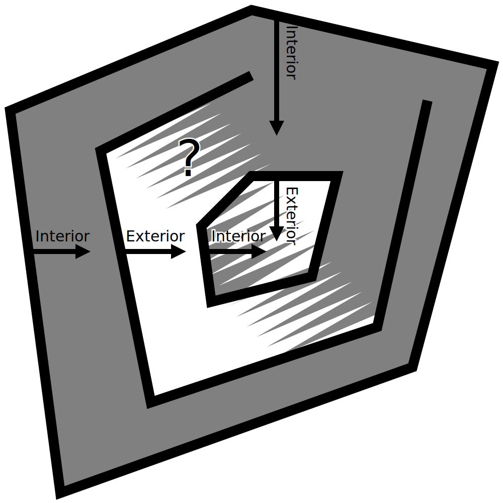

Piezas que faltan
====
A veces, al inspeccionar la vista de capas (o si hay mala suerte, mientras se imprime), parece que faltan algunas piezas de la impresión. Esto puede tener varias razones. Este artículo nombra algunas posibilidades.

Mallas no plegables
----
Algunas mallas tienen agujeros en su superficie o geometría extra en el interior. Esto confunde a Cura, porque ya no está claro qué partes del volumen pertenecen al interior y cuáles no. Al mirar una sección transversal del modelo, Cura contará desde fuera hacia dentro. La primera superficie que cruza significa que va al interior del modelo. La segunda superficie significa que va al exterior de nuevo. La tercera superficie que cruza significa que vuelve al interior, y así sucesivamente. Si faltan partes de las superficies, o si hay superficies extra sueltas en el medio, el interior se vuelve ambiguo dependiendo del lado desde el que se mire.

Con las mallas de colectores, está claro dónde está el interior del modelo](../images/manifold_correct.svg)

Las mallas a las que les faltan superficies o piezas adicionales se denominan no manifiestas, ya que no podrían existir en el mundo real. Cura intentará repararlas cerrando los pequeños huecos, pero si una superficie no puede ser reparada se dejará fuera de la impresión (a no ser que [Surface Mode](../blackmagic/magic_mesh_surface_mode.md) esté configurado para incluirlas). La geometría que falta o sobra también se muestra en la escena 3D con un patrón de manchas, o en rojo en la etapa de Preparación cuando se utiliza la vista de rayos X. Esto coloreará la superficie de forma diferente si pertenece a un número impar de superficies, lo que ocurre sólo cuando la malla no es múltiple. Esto ayuda a identificar los problemas de su malla. Entonces tendrá que reparar esas mallas en una aplicación de CAD o de modelado.

Las mallas que no son manifiestas se muestran con partes rojas en la vista de rayos X](../images/x_ray.png)

Aunque Cura normalmente asume que la malla es múltiple, puede arreglar el modelo en algunos casos. Estas son algunas cosas que puede probar:
* [Extensive Stitching](../meshfix/meshfix_extensive_stitching.md) maneja mejor los casos en los que hay geometría extra adherida al exterior de un modelo, aunque toma algo de tiempo extra para cortar.
* [Keep Disconnected Faces](../meshfix/meshfix_keep_open_polygons.md) cerrará todos los bucles abiertos con una línea recta. Esto cerrará muy bien los huecos pequeños. Sin embargo, también puede hacer que el modelo tenga un aspecto muy extraño si hay grandes huecos en él.
* Como último recurso, el [Modo Superficie](../blackmagic/magic_mesh_surface_mode.md) se puede utilizar para imprimir las piezas con agujeros como una sola pared, sin ningún contenido. Como no se sabe dónde está el interior de esta pieza, no habrá ningún relleno o piel, pero al menos se puede dibujar el contorno. En algunos casos, esto puede hacer que la impresión siga pareciendo pasable.

Si estas opciones no producen la impresión deseada, tendrás que repararlas manualmente con aplicaciones de modelado 3D.

Piezas finas
----
Si el modelo tiene detalles muy finos, no todo puede ser dibujado con las líneas gruesas que salen de tu impresora 3D. Cura ajustará las líneas dentro de la forma trazada por su malla. Si esto no es posible, no se imprimirá nada. En ese caso, puede parecer que faltan partes de la impresión.

Hay un par de cosas que se pueden hacer al respecto:
<!--if cura_version>=5.0-->* Activar el ajuste [Print Thin Walls](../shell/fill_outline_gaps.md). ¡Esto permitirá a la impresora utilizar líneas más finas para imprimir piezas muy finas, aunque podrían llegar a ser más anchas de lo que el modelo pretende que sean.<!
* Reduce el [ancho de línea] (../resolution/line_width.md). Si está imprimiendo algo que tiene paredes finas o bandas, asegúrese de que el ancho de línea es ligeramente menor que el ancho mínimo de esa parte. Sin embargo, reducir el ancho de línea demasiado puede causar [underextrusión](underextrusion.md) debido a un flujo insuficiente. Para poder reducir más el ancho de línea, tendrá que utilizar una boquilla más pequeña.
* Agregue un poco de [expansión horizontal](../shell/xy_offset.md) a la impresión. Esto hace que todo el modelo sea más ancho en todos los lados, incluyendo las partes delgadas. Se vuelven menos delgadas de esa manera, por lo que ahora pueden ser impresas. Esto, por supuesto, también arruina cualquier precisión dimensional y detalle de la impresión, ya que todo se vuelve más grueso.
<!--if cura_version<5.0:* Habilite el ajuste [Print Thin Walls](../shell/fill_outline_gaps.md). Esto intentará rellenar las partes delgadas con líneas muy pequeñas sin reducir el ancho de línea del resto del modelo. Sin embargo, esto causa grandes cambios en la tasa de flujo del material y puede que no siempre llene las paredes con líneas bonitas y uniformes.
* Considere la posibilidad de ajustar el modelo a la impresión, haciendo cada pieza al menos tan gruesa como su ancho de línea.
