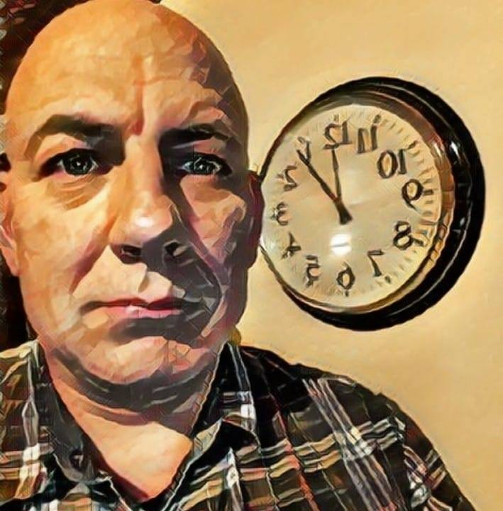

Ce projet est maintenu par Ghostkeeper.

Programmation
----
* Ghostkeeper: Ecriture de la version V1.1 est suivante.
* Asasin: Writing v1.0.
* Laurent LALLIARD Traduction française

Articles
----
* Ghostkeeper: réécriture de tout le contenu de la v2.0 et de nombreux articles depuis.
* Ellecross: une grande partie du contenu de la v1.0.
* Jeroen Stevens: Une grande partie du contenu de la v1.0.
* ChrisTerBeke: article sur la hauteur de couche adaptative.

