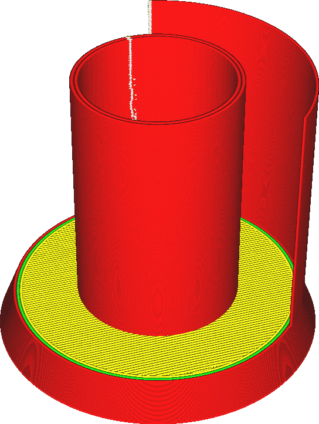

Normalement, Cura crée des sections transversales de tous les triangles de votre maillage. Ces segments de ligne sont cousus ensemble pour former des boucles. Les boucles qui ne sont pas fermées seront rejetées.

Ce paramètre contrôle ce qui sera fait avec ces boucles non fermées. Si ce paramètre est réglé sur "Normal", elles sont rejetées. S'il est réglé sur "Surface", toutes les sections transversales sont imprimées sous forme de contours. Si le paramètre est réglé sur "Les deux", les contours fermés sont imprimés normalement, mais les contours non fermés sont imprimés séparément sous forme de murs supplémentaires.

Les surfaces supplémentaires qui seront imprimées ne comprendront que les surfaces verticales sous forme de lignes simples. Il n'y a pas de technique de remplissage pour les surfaces horizontales, car les surfaces ne sont pas des polygones fermés. Elles ne peuvent pas être remplies puisqu'il n'y a pas d'intérieur. Il ne peut pas y avoir de dessus, de dessous, de remplissage ou de supports. Seulement des lignes simples.

Les surfaces supplémentaires seront imprimées comme s'il s'agissait de parois extérieures, elles seront donc affectées par la vitesse d'impression des parois extérieures, la largeur des lignes, etc.

*Si vous imprimez à la fois les volumes normaux et les surfaces supplémentaires, n'oubliez pas que les volumes seront imprimés avec la paroi extérieure complètement à l'intérieur du volume. Les surfaces supplémentaires sont imprimées avec la ligne centrée sur la surface, avec la moitié de la largeur de la ligne de chaque côté. Si une surface supplémentaire est alignée sur la surface d'un volume fermé, comme dans les images ci-dessus, la surface sera décalée d'une demi-ligne. Après tout, la surface supplémentaire n'a pas d'intérieur vers lequel se déplacer.*
