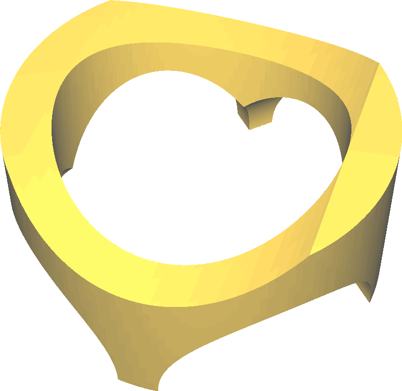
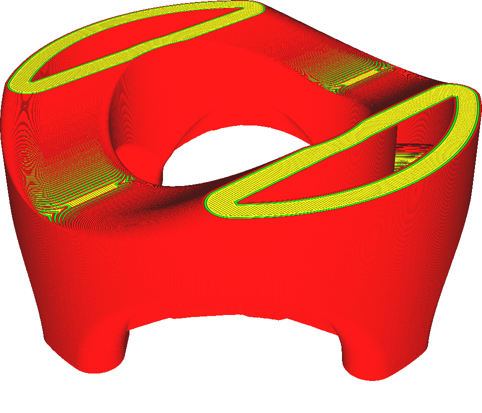

Moule
====
Au lieu d'imprimer le modèle lui-même, cette fonction amène l'imprimante à créer un négatif du modèle, un moule, dans lequel vous pourriez couler un matériau différent pour créer votre modèle. Ce moule possède plusieurs propriétés spécifiques qui le rendent à la fois utilisable pour le moulage et imprimable avec l'impression FDM.

La génération de moules de Cura créera un creux ayant la forme exacte que vous voulez mouler. Autour de ce creux, une coquille sera générée avec une certaine largeur, configurable grâce au paramètre [Largeur minimal de moule](mold_width.md). Au-dessus et en dessous du moule, une peau sera générée avec une certaine hauteur, configurable grâce au paramètre [Hauteur du plafond de moule](mold_roof_height.md). Toutefois, cette peau ne sera pas générée tout en haut du modèle afin que vous puissiez y verser le matériau de moulage. Elle ne sera pas non plus générée tout en bas du modèle. Vous devez la garder sur la plaque de construction pendant le moulage.

Conception de votre moule
----
La génération de moule de Cura n'est pas parfaite. Il manque quelques éléments. Voici quelques conseils pour les corriger.
* Cura ne crée pas de carottes pour tous les maxima locaux de votre modèle. Vous devez ajouter des tiges verticales à votre modèle partout où vous avez besoin d'une carotte.
* Cura ne permet pas de couler du matériau supplémentaire au cas où votre matériau se rétracterait en refroidissant. Vous devez ajouter des tiges supplémentaires même au point le plus élevé de votre modèle si vous utilisez un matériau qui rétrécit beaucoup.
* Le moule de Cura est toujours en une seule pièce. Pour de nombreuses formes, cela signifie que le moule doit être détruit pour pouvoir être enlevé. Les moules peuvent être détruits de différentes manières : par la force pure ou en les chauffant si le matériau à l'intérieur le permet, ou en utilisant un matériau comme le PVA qui se dissout dans l'eau.
* Cura ne permet pas de mettre des tiges ou des fils pour renforcer le moule. Pour ce faire, placez des barres supplémentaires dans votre modèle afin que Cura leur laisse des cavités, et insérez ensuite la tige ou le fil.
* Les contre-dépouilles dans votre moule sont générées sans avertissement. Si votre moule a besoin de beaucoup de contre-dépouilles, vous aurez besoin de quelques carottes ou d'autres canaux pour que le matériau y pénètre correctement et que l'air en sorte. Sachez également que votre moule peut avoir besoin d'être détruit afin de pouvoir sortir le moulage une fois qu'il est solidifié.

Matériaux pour imprimer le moule
----
Le moule idéal est :
* très rigide
* résistant aux températures élevées
* chimiquement inerte afin qu'il ne se lie pas à votre matériau de moulage
* ne pas rétrécir

De plus, certains moules doivent être détruits pour pouvoir sortir le modèle. Pour ce faire, vous pouvez choisir un matériau fragile ou un matériau qui peut être dissous à l'aide d'eau ou d'autres produits chimiques, comme le PVA.

Matériaux à utiliser pour le moulage
----
Lorsque vous choisissez un matériau à couler, gardez à l'esprit que l'impression FDM ne peut fonctionner qu'avec des thermoplastiques. Les thermoplastiques sont des plastiques qui deviennent intrinsèquement mous à haute température. Cela n'est pas compatible avec les matériaux de moulage qui sont chauds au moment du moulage. Certains matériaux sont généralement incompatibles avec les moules imprimés en 3D :
* **Les métaux**, qui doivent être chauffés au-dessus du point de fusion des plastiques afin d'être suffisamment liquides pour être moulés. La masse thermique du métal fera fondre votre moule.
* **Plastiques qui se lient** au plastique dont le moule est fait. Vous ne pouvez pas séparer le moule du modèle après le moulage. Vous pouvez vaporiser un peu de démoulant, mais si le matériau est trop semblable, il se liera toujours au moule de façon permanente.
* **Matériaux qui rétrécissent** trop après s'être solidifiés. Les matériaux qui se rétractent avant de se solidifier sont acceptables à condition que vous ayez des carottes suffisamment longues pour permettre au nouveau matériau de remplir la cavité lorsque cela se produit.
* **La résine époxy** n'est pas appropriée parce que lorsque la résine est froide pendant le moulage, la réaction chimique des deux composants dégage assez de chaleur pour faire fondre le plastique. L'époxy a également tendance à très bien adhérer aux plastiques.

Certains matériaux sont plus appropriés pour le coulage :
* **Silicone**. Le silicone ne se lie pas aux plastiques, il est donc facile à enlever. Le silicone est également très flexible, ce qui le rend indulgent pour les contre-dépouilles. De plus, les silicones sont thermodurcissables et résistants à la chaleur, vous pouvez donc envisager de faire fondre le moule après qu'il ait été durci. Il faut cependant un outillage spécial pour couler le silicone. Vous aurez notamment besoin d'une chambre à vide pour pomper les bulles de gaz du silicone.
* **Sable**. Le sable est une norme industrielle pour la fabrication d'un négatif de quelque chose car il est très résistant à la chaleur mais n'a pas besoin d'être chauffé pour être coulé. Après l'avoir coulé, vous pouvez le lier avec du béton ou de la colle afin d'éviter qu'il ne se désagrège. Vous pouvez ensuite l'utiliser pour réaliser un autre négatif à partir d'un matériau plus résistant à la chaleur.
* **Cire**. Pour fabriquer des bougies ou des figurines sur mesure, vous pouvez couler un modèle en cire. La cire a une faible température de fusion, elle ne fond pas le moule. Elle ne lie pas non plus la cire.
* **Chocolat**, comme une gâterie ou un cadeau spécial personnalisé. Pour couler le chocolat, faites-le fondre juste au-dessus de son point de fusion, puis coulez-le, faites-le vibrer un peu pour faire sortir les bulles d'air et mettez-le immédiatement au congélateur. Vous pouvez même mettre le moule dans un bain d'eau froide à l'intérieur du congélateur pour en soustraire la chaleur plus rapidement. Au bout de cinq minutes, retirez soigneusement le chocolat du moule.

Si vous devez créer un objet dans un matériau qui n'est pas directement compatible avec l'impression 3D, vous devez travailler en plusieurs étapes de moulage. Chaque étape crée un négatif de l'étape précédente. Par exemple, vous pouvez imprimer la forme de votre objet normalement (avec ce paramètre désactivé), puis créer un négatif de celui-ci en mettant le moule dans un bain de stuc. Comme le stuc est beaucoup plus résistant à la chaleur, vous pouvez alors utiliser des matériaux qui doivent être chauffés plus fort pour fondre, comme le bronze, ou des matériaux qui se lient aux plastiques comme l'époxy.

Le processus de moulage
----
Le moulage avec un moule imprimé en 3D est en grande partie le même qu'avec n'importe quel autre moule et dépend beaucoup des matériaux utilisés. Il y a cependant quelques points qui méritent une attention particulière lorsqu'il s'agit de moules imprimés en 3D.

Le thermoplastique avec lequel vous avez imprimé votre moule a une faible capacité thermique et peut avoir une température de transition vitreuse assez basse. Cela signifie que le temps est un facteur essentiel après le moulage du moule. Si le matériau refroidit trop lentement, le moule risque de se ramollir. Cela peut entraîner une déformation du moule et rendre plus difficile le démoulage du résultat. Pour accélérer la prise du moule, vous pouvez par exemple le plonger dans un bain de glace.

Les moules imprimés en 3D présentent également davantage de stries sur leurs côtés en raison des limites entre les couches. Il est donc plus difficile de démouler le moule. Si vous utilisez un agent de démoulage entre le moule et la pièce moulée, utilisez quelque chose qui peut combler ces lacunes. Les lubrifiants fins ne suffisent pas. Les couches d'interface les plus appropriées sont la cire ou des lubrifiants plus épais.
