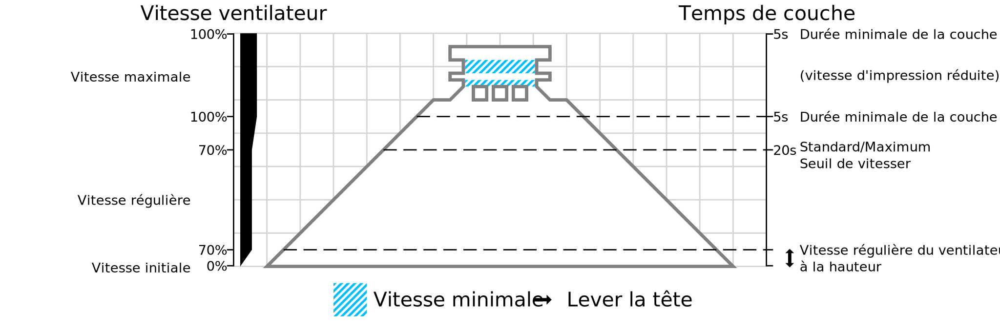

Durée minimale d’une couche
====
Le temps minimum de couche configure la durée la plus courte autorisée pour l'impression d'une couche. L'imprimante n'est pas autorisée à imprimer des couches plus rapidement que cela.

Ceci est nécessaire pour permettre à la couche précédente de refroidir avant que la couche suivante ne soit mise par-dessus. Cela permet de s'assurer que la couche précédente s'est complètement solidifiée, pour éviter qu'elle ne s'affaisse.

Cette option a trois effets :
* Si une couche s'imprime plus vite que ne l'indique le paramètre [Limite de vitesse régulière/maximale du ventilateur](cool_min_layer_time_fan_speed_max.md), la vitesse du ventilateur sera augmentée pour atteindre la [Vitesse maximale du ventilateur](cool_fan_speed_max.md). Lorsqu'une couche est si petite qu'il faut moins de temps pour l'imprimer, la vitesse maximale du ventilateur sera utilisée. La vitesse du ventilateur est interpolée entre les deux.
* Si la couche prend moins de temps que le temps minimum de couche pour s'imprimer, la vitesse d'impression sera ralentie de telle sorte qu'elle prendra toujours le temps minimum de couche.
* Si la tête d'impression est trop ralentie (impression plus lente que le paramètre [Vitesse Minimum](cool_min_speed.md)), la tête d'impression attendra à la fin d'une couche et soulèvera éventuellement un peu la tête.

Il y a un compromis à faire lorsque l'on ralentit la buse pour permettre à la couche de mieux se refroidir. Le temps de couche minimum est destiné à donner un certain temps au matériau pour se refroidir en ralentissant le mouvement de la tête d'impression. Pendant ce temps, les ventilateurs souffleront à leur puissance maximale pour le refroidir plus rapidement, mais la buse chaude est également toujours sur le plastique. Pour les très petites pièces, la buse chaude peut transférer plus de chaleur dans l'impression que ce que les ventilateurs peuvent évacuer. Cela fait fondre le plastique encore plus que si vous n'aviez pas de temps de couche minimum.

Lors de l'impression de matériaux relativement froids ou si les ventilateurs de la tête d'impression sont particulièrement puissants, le matériau tolérera un temps de couche minimum plus élevé pour réduire l'affaissement. Si le temps de couche minimum est trop élevé, la buse ralentira de plus en plus souvent, ce qui provoque des bavures et un affaissement à certains endroits également.
