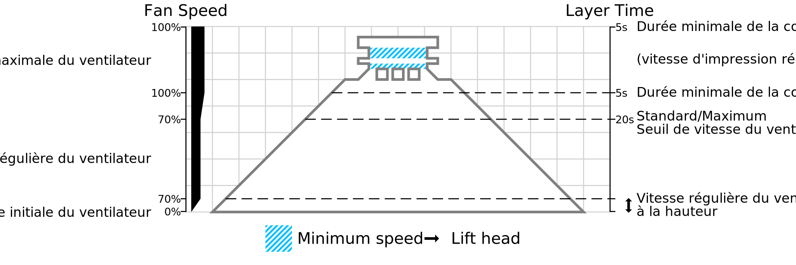

Limite de vitesse régulière/maximale du ventilateur
===

Ce paramètre détermine le temps d'impression de la couche à laquelle il est si court que la vitesse du ventilateur commence à augmenter pour atteindre la [vitesse maximale du ventilateur](cool_fan_speed_max.md). Les couches qui prennent plus de temps à imprimer utiliseront la [vitesse normale du ventilateur](cool_fan_speed_min.md). Pour les couches dont le temps d'impression est plus court, la vitesse du ventilateur sera interpolée entre les paramètres de vitesse normale et de vitesse maximale du ventilateur, jusqu'à la [durée minimale de la couche](cool_min_layer_time.md) où la vitesse du ventilateur sera à la vitesse maximale du ventilateur.

