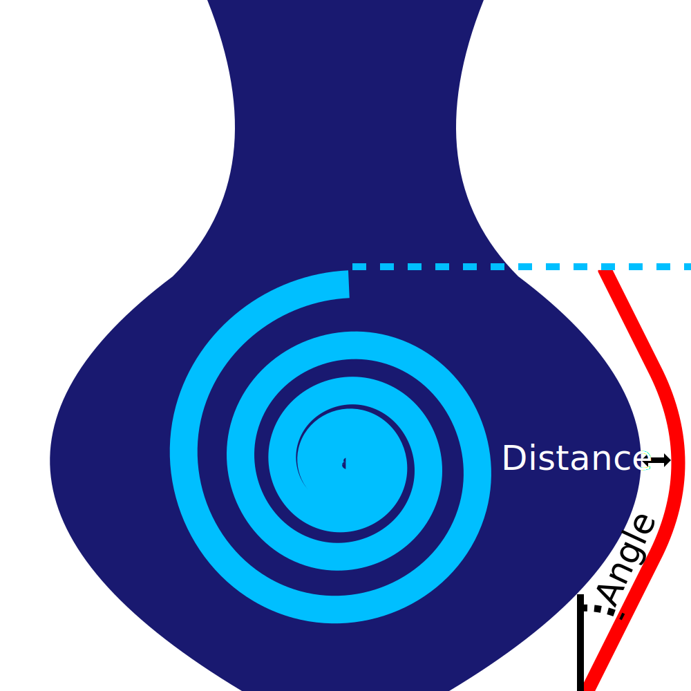

Distance du bouclier de suintage
====
Ce paramètre détermine la distance que le bouclier anti-fuite doit garder (au minimum) par rapport à votre objet. Une petite distance doit être respectée pour éviter que la plaque de suintement ou les taches qu'elle porte ne collent à votre modèle.

Placez le bouclier de suintement aussi près que possible du modèle sans frapper celui-ci. Plus le bouclier est proche de votre modèle, moins il y a de temps entre le bouclier et le modèle pour que la buse suinte davantage.

Parfois, le bouclier sera plus éloigné du modèle, car le bouclier doit également maintenir un certain [angle de surplomb](./ooze_shield_angle.md) pour ne pas s'effondrer.
