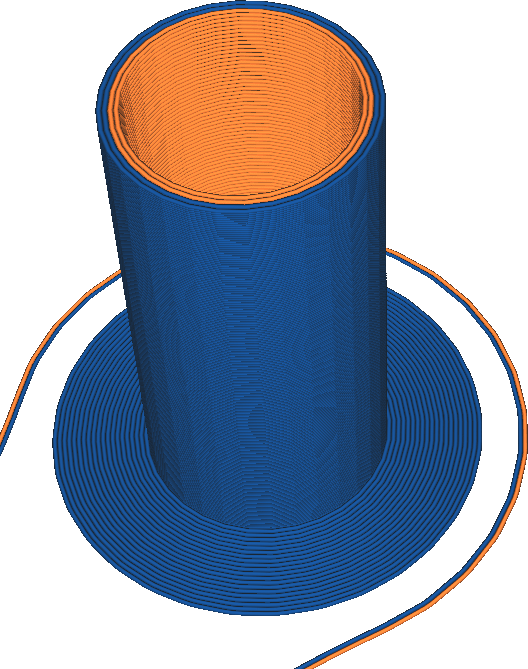

Bordure de la tour d'amorçage
====
Le bord principal de la tour est un bord supplémentaire, similaire à l'option de bord dans le [Type d'adhérence du plateau](../platform_adhesion/adhesion_type.md). Ce bord peut être activé et désactivé séparément de l'adhésion ordinaire. Lorsqu'il est activé, un bord supplémentaire sera imprimé autour de la tour d'amorçage. Ce bord est un disque plat autour de la tour de base d'une seule couche qui améliore l'adhérence de la tour de base au plateau d'impression.

L'activation du bord de la tour d'amorçage donnera à celle-ci plus de surface pour se connecter au plateau d'impression. Comme la tour d'amorçage peut devenir assez haute et mince, elle peut basculer pour les très grandes empreintes. Le bord de la tour d'amorçage est destiné à éviter cela, pour un coût minime en termes de temps d'impression, de matière et d'espace sur la plaque de montage.

Le bord de la tour d'amorçage aura la largeur définie dans le paramètre [Largeur de la bordure](../platform_adhesion/brim_width.md). Si le type d'adhérence de la plaque de construction est défini sur le bord, ce paramètre double effectivement la largeur du bord autour de la tour d'amorçage.

Le bord de la tour d'amorçage ne peut pas être combiné avec un radeau.
