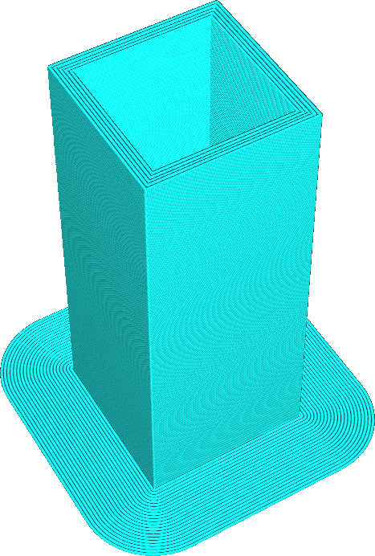
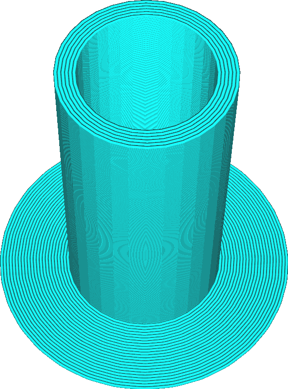

Tour primaire circulaire
====
Si ce réglage est activé, la tour d'amorçage aura la forme d'un cylindre. Si elle est désactivée, la tour d'amorçage sera carrée.

Dans les deux cas, la tour d'amorçage est encore creuse. La tour d'amorçage circulaire est pratiquement plus petite que la tour d'amorçage carrée (car les coins sont coupés). Le [volume minimum](prime_tower_min_volume.md) sera toujours correct.

Si le matériau a tendance à se déformer, la tour d'amorçage carrée possède quatre coins qui peuvent se décoller de la plaque de construction. Elle a donc plus de chances de basculer que la tour d'amorçage circulaire. L'impression d'une tour carrée implique également des accélérations plus importantes. Ces accélérations rendent le débit irrégulier, ce qui n'est pas ce que vous souhaiteriez pour amorcer le matériau.

La tour d'amorçage circulaire étant meilleure sous presque tous les aspects,ce réglage est supprimé dans les nouvelles versions de Cura. Les nouvelles versions auront toujours une tour d'amorçage circulaire.
