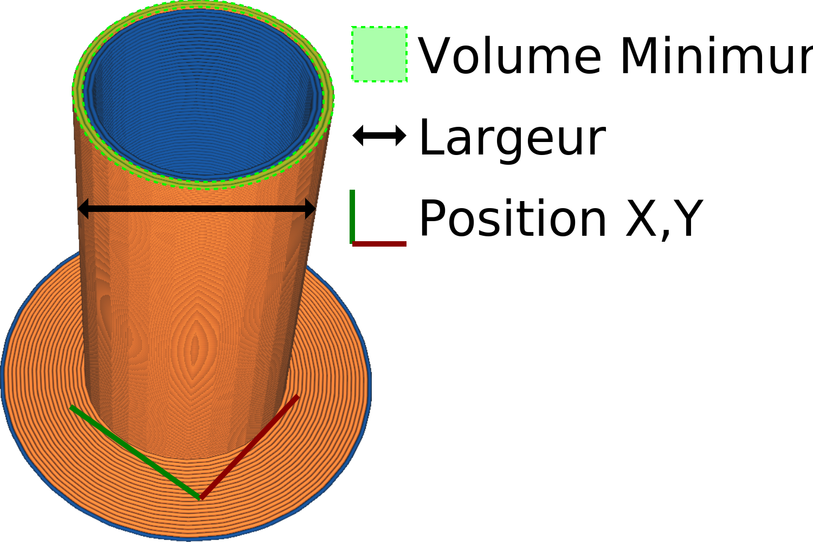

Volume minimum de la tour d'amorçage
====
Cela indique la quantité de matière à purger à chaque changement d'extrudeuse. L'idée est qu'un certain volume aura suinté de la buse lorsqu'elle était en veille. Le volume d'amorçage indiqué par ce réglage est censé compenser cela.

Ce paramètre indique la quantité minimale de matière à purger. Les contours de la tour principale seront cependant complètement finis, donc plus de matériau peut être purgé en fonction de la façon dont le volume s'aligne avec le volume d'un contour.

Certaines imprimantes ont plusieurs buses séparées, tandis que d'autres alimentent plusieurs matériaux dans une seule buse. Une bonne valeur pour ce réglage est très différente entre les deux.
* Si votre imprimante a plusieurs buses, la seule nécessité pour le volume amorcé est de récupérer le matériau perdu pendant que l'autre buse était active. Elle aura suinté un peu de matière, et la pression dans la chambre de la buse aura été perdue. Une petite quantité de matière suffit pour remettre la chambre de la buse en pression. Les matériaux plus coulants, comme le PETG, nécessitent généralement un volume d'amorçage plus important. Si le volume minimum de la tour d'amorçage est trop faible, vous obtiendrez de la [sous-extrusion](../troubleshooting/underextrusion.md) au début du trajet d'extrusion après le changement d'extrudeuse.
* Si votre imprimante extrude plusieurs filaments dans la même buse, la tour d'amorçage doit également purger le matériau restant de la buse. En rétractant le filament précédent, une petite goutte restera toujours dans la buse parce que le matériau qui s'y trouvait était liquide sous la zone de chaleur et n'est pas entraîné avec le reste du filament. Le volume minimal de la tour d'amorçage doit donc être au moins égal au volume de toute la zone chaude de la buse. En pratique, il faut beaucoup plus que cela, car lorsque le nouveau filament est poussé, il se mélange avec l'ancien filament et l'écrase. Il faut beaucoup plus de matériau comme tampon pour faire sortir tout l'ancien matériau, afin d'éviter la contamination. Tout cela est bien plus que le souci de récupérer la pression de la buse à cause du suintement, donc le suintement n'est plus un problème. Si le volume minimum de la Tour d'amorçage est trop faible, les matériaux se mélangeront dans ce cas, de sorte que les couleurs baveront davantage, ou vous aurez des marques dans votre impression après avoir dissous le matériau de support soluble dans l'eau.

Un volume minimum trop élevé est relativement inoffensif, mais prolonge la durée de l'impression et gaspille davantage de matériau. Le volume sera limité par la [taille de la tour d'amorçage](prime_tower_size.md). Le volume peut être fixé à un niveau supérieur au volume total de la tour principale sur cette couche, mais si la tour d'amorçage est prévue pleine, cela n'aura plus aucun effet sur l'impression.

Le volume peut être différent pour chaque extrudeuse, de sorte que la tour finale peut avoir un nombre différent de contours pour chacune des extrudeuses.
