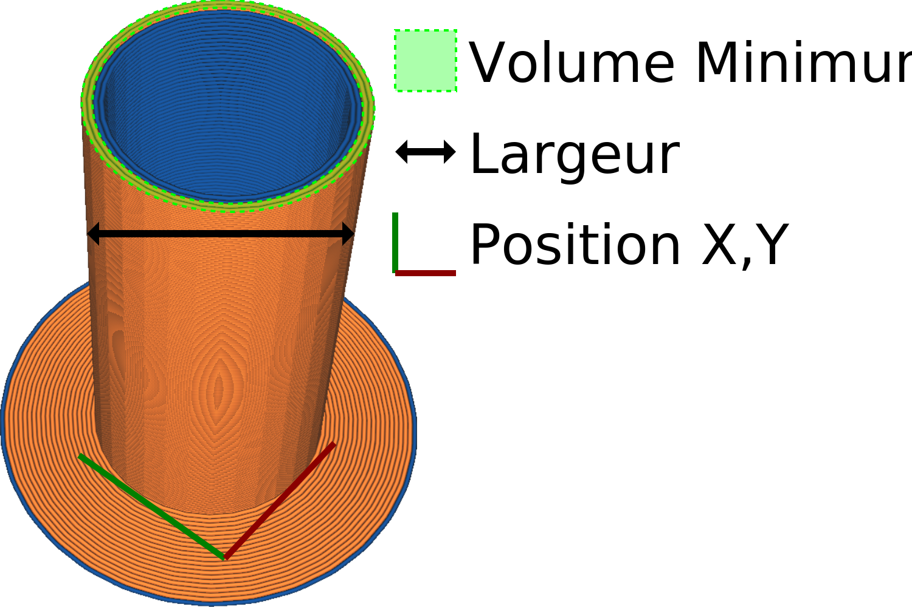

Position X de la tour primaire
====
Ce réglage vous permet de repositionner la tour principale. Il indique la coordonnée X d'un coin de la tour principale.

Notez que ces coordonnées n'indiquent pas le centre de la tour principale, mais le coin ayant les coordonnées X et Y les plus basses.
