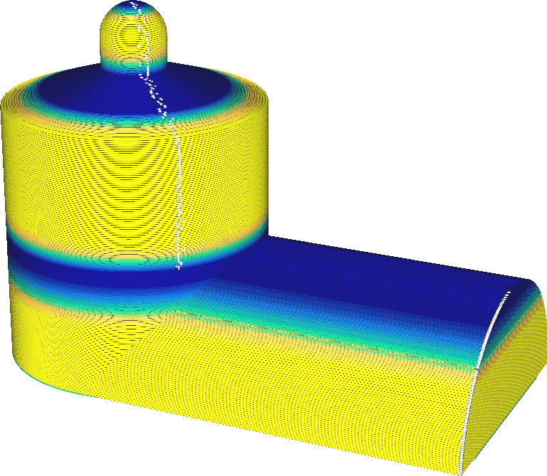

Utiliser des couches adaptatives
====
Les couches adaptatives permettent d'ajuster localement l'épaisseur de votre impression afin d'optimiser le temps et la qualité d'impression en fonction des caractéristiques de surface du modèle. Les couches seront rendues plus fines lorsque les pentes sont faibles, ou plus épaisses lorsque les parois sont raides. L'objectif est d'imprimer rapidement lorsque c'est possible, tout en continuant à imprimer de manière détaillée lorsque c'est nécessaire.

La hauteur des couches est ajustée de telle sorte que la distance horizontale entre les bords des couches reste constante. Les surfaces peu profondes provoquent un grand déplacement horizontal avec un petit déplacement vertical, donc un petit déplacement vertical est fait pour garder le déplacement horizontal constant. Les surfaces raides provoquent un petit déplacement horizontal avec un grand déplacement vertical, de sorte qu'un grand déplacement vertical est effectué pour maintenir le déplacement horizontal constant. Ainsi, l'[effet topographique](../troubleshooting/topography.md) des couches est maintenu constant. La distance maximale entre deux couches adjacentes est maintenue à une distance constante du paramètre [Taille de la topographie des couches adaptatives](adaptive_layer_height_threshold.md).

Si le modèle comporte à la fois des surfaces peu profondes et des surfaces abruptes à la même hauteur, l'épaisseur de la couche est considérée comme étant la plus petite des épaisseurs de couche. Cela rend parfois la hauteur de la couche inutilement petite parce qu'il y a une surface horizontale à côté. On peut le voir sur la capture d'écran ci-dessus ainsi qu'à mi-chemin de la hauteur du silo sur la gauche.

L'utilisation de couches adaptatives est fortement limitée afin d'améliorer la qualité d'impression. La hauteur de la couche ne doit pas s'écarter de plus d'une [Hauteur maximale autorisée par rapport à la couche de base, en mm](adaptive_layer_height_variation.md) spécifiée par rapport au paramètre original [Hauteur de la couche](../resolution/layer_height.md). Entre deux couches adjacentes, la différence de hauteur de couche ne peut pas dépasser une certaine [taille des étapes de variation des couches adaptatives](adaptive_layer_height_variation_step.md). L'épaisseur de la couche passe ainsi progressivement d'une couche à l'autre au lieu de la couper soudainement en deux.

Les couches adaptatives peuvent réduire considérablement le temps d'impression sans subir de perte de qualité d'impression, voire en améliorant la qualité dans certains cas. L'effet de l'ajustement de l'épaisseur de la couche est immense. Dans la plupart des cas, le temps d'impression sera considérablement réduit, grâce à l'utilisation de couches plus épaisses lorsque le modèle est vertical. L'l'[effet topographique](../troubleshooting/topography.md) est également réduit parce que les couches sont plus rapprochées horizontalement.

Cependant, cette caractéristique peut également introduire un certain nombre de problèmes.
* En changeant la hauteur des couches, il faut généralement régler d'autres paramètres, comme la température de la buse. Les couches adaptatives n'ajustent pas automatiquement ces autres paramètres. Cela peut rendre l'impression sous-optimale, par exemple pour les surplombs qui seraient plus performants à une température d'impression plus basse.
* Si la hauteur de la couche est modifiée sur l'ensemble de la couche pour un petit élément situé quelque part dans une petite partie de la couche, les bandes seront visibles dans le reste de la couche.
* Les distances verticales sont également ajustées involontairement dans ce cas. Cela peut avoir un effet négatif sur la qualité de l'impression. Par exemple, l'épaisseur du [Épaisseur du dessus/dessous](../shell/top_bottom_thickness.md) sera généralement plus faible parce que Cura conservera le paramètre [Couches supérieures](../top_bottom/top_layers.md) comme étant vrai, et les couches deviendront plus fines. Cela peut provoquer un effet d'oreiller. Parmi les paramètres affectés qui peuvent ne plus être corrects, on peut citer
  * [Épaisseur du dessus](../top_bottom/top_thickness.md)
  * [Épaisseur du dessous](../top_bottom/bottom_thickness.md)
  * [Angle maximum de la couche extérieure pour l'expansion](../top_bottom/max_skin_angle_for_expansion.md)
  * [Hauteur de l'étape de remplissage progressif](../infill/gradual_infill_step_height.md)
  * [Hauteur d'étape de remplissage graduel du support](../support/gradual_support_infill_step_height.md)
  * [Épaisseur de la couche de remplissage](../infill/infill_sparse_thickness.md)
  * [Épaisseur de la couche de remplissage de support](../support/support_infill_sparse_thickness.md)
  * [Distance Z des supports](../support/support_z_distance.md)
  * [Épaisseur du plafond de support](../support/support_roof_height.md)
  * [Épaisseur du bas de support](../support/support_bottom_height.md)
  * [Angle de porte-à-faux de support](../support/support_angle.md)
  * [Hauteur de la marche de support](../support/support_bottom_stair_step_height.md)
  * [Angle du toit de la tour](../support/support_tower_roof_angle.md)
  * [Angle du bouclier de suintage](../dual/ooze_shield_angle.md)
  * [Angle maximal du modèle](../experimental/conical_overhang_angle.md)
