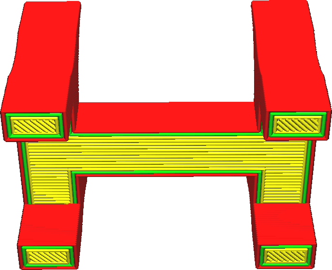
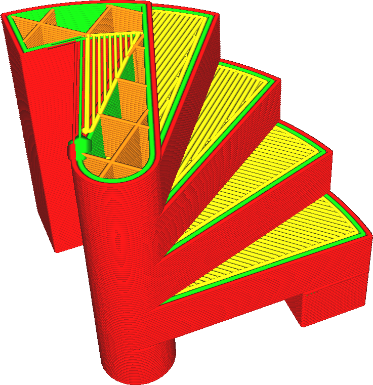

Activer les paramètres du pont
===

Lorsque votre modèle présente un certain surplomb qui est soutenu des deux côtés, Cura le détecte et modifie la zone de peau en surplomb afin de mieux imprimer. Si ce paramètre est activé, vous pouvez régler la détection de ces zones de chevauchement et le comportement qui en résulte afin qu'il y ait un meilleur chevauchement.

Normalement, Cura utilisera une technique de transition assez rudimentaire. Cura détectera les zones de peau en surplomb qui sont soutenues sur plusieurs côtés. La [direction de ces lignes de peau](../shell/skin_angles.md) est ajustée pour couvrir ces zones automatiquement. Cela permet de s'assurer que la plus grande partie possible de la zone en surplomb est supportée sur plusieurs côtés et d'améliorer la qualité d'impression.

Lorsque ce paramètre est activé, vous pouvez toutefois régler ce comportement de manière plus précise en fonction de vos besoins. Cela vous permet d'apporter des modifications :
* vitesse d'impression
* débit
* densité (comme la densité de remplissage, mais avec les lignes de la peau)
* vitesse du ventilateur
* pour les murs, également en côte

Ces paramètres peuvent être réglés séparément pour la peau qui comble un vide ainsi que pour les murs. Si l'option [Le pont a plusieurs couches](bridge_enable_more_layers.md) est activée, ils peuvent également être ajustés séparément pour la deuxième et la troisième couche au-dessus de l'écart ponté. Il est également possible de modifier les parties de l'impression qui sont considérées comme des zones de pontage, en réglant [quelle fraction de la zone doit être au-dessus de l'air](bridge_skin_support_threshold.md) et une [largeur minimale pour les murs](bridge_wall_min_length.md).

En activant les paramètres de pontage, vous avez un meilleur contrôle sur la façon dont les ponts sont traités dans votre impression. En réglant très bien les paramètres de pontage, vous pouvez améliorer la qualité de vos débords de manière significative et améliorer la précision dans le sens vertical. Le seul inconvénient est que si vous n'ajustez pas les paramètres de pontage à votre imprimante, l'impression risque d'être tout aussi mauvaise.

