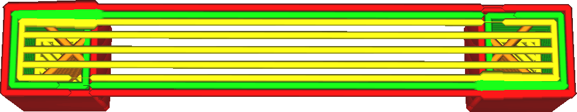

Densité de la couche extérieure du pont
====
Ce paramètre contrôle la densité de la face inférieure de l'impression lorsqu'elle comble un vide. À une densité de 100 %, les lignes sont placées directement à côté. À des densités plus faibles, les lignes sont plus espacées.

Deux effets majeurs entrent en jeu lors du réglage de ce paramètre : L'adhérence entre les lignes et le refroidissement.

Lorsque les lignes de la peau sont directement adjacentes, elles adhèrent les unes aux autres. Cela rendra le côté inférieur de l'espace ponté plus joli, puisque la surface sera continue au lieu d'être en cordon. En outre, la deuxième ligne peut s'appuyer un peu sur la première ligne pendant le pontage, ce qui réduit un peu l'affaissement du pont.

Mais il y a un autre effet, c'est le refroidissement. Lorsque les lignes sont plus espacées, elles peuvent se refroidir plus rapidement et ne s'affaissent pas autant non plus. Bien sûr, cela ne s'applique que lorsque le ventilateur est en marche, donc pour les matériaux à haute température, cette stratégie ne va pas fonctionner.

Lequel de ces effets est le plus fort dépend de la viscosité du matériau, de la vitesse à laquelle il se solidifie et de la vitesse du ventilateur. Un certain réglage est toujours nécessaire.

**Si le  est inférieur à 100 %, il y aura également un certain espacement entre les lignes même si la densité est de 100 %, car les lignes seront alors plus fines.
