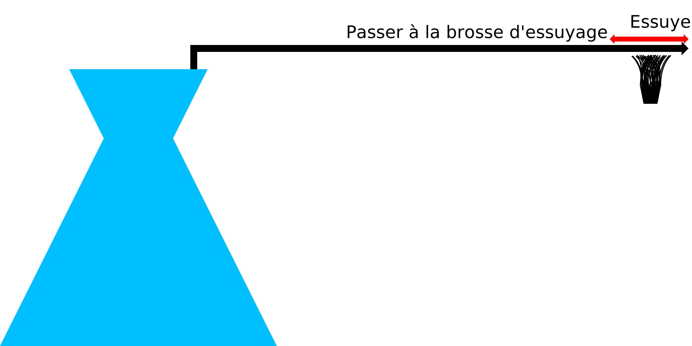

Essuyer la buse entre les couches
====
Ce réglage permet d'exécuter une procédure à la fin de chaque couche pour essuyer toute matière de l'embout de la buse. Si votre imprimante est équipée d'une brosse d'essuyage intégrée, l'activation de ce paramètre amènera Cura à demander à l'imprimante d'essuyer périodiquement l'embout de cette brosse.

Cette procédure d'effacement comprend un certain nombre d'étapes :
1. Si [rétraction est activée](wipe_retraction_enable.md), le matériau est rétracté.
2. Si le [saut en Z est activé](wipe_hop_enable.md), la buse est déplacée vers le haut ou le plateau d'impression vers le bas.
3. La buse est déplacée au-delà de la [position de la brosse](wipe_brush_pos_x.md).
4. La buse est essuyée [un certain nombre de fois](wipe_repeat_count.md) sur la brosse.
5. La buse est ramenée à sa position initiale.
6. Le saut en Z est terminé, s'il a été activé. Le matériau se détache.
7. L'impression s'arrête pendant une [certaine période](wipe_pause.md).

Le but de cette procédure est de nettoyer périodiquement la buse de tout débris. Certains matériaux ont tendance à remonter vers la buse par capillarité en raison d'une tension superficielle élevée. Ces matériaux peuvent s'infiltrer dans la tête d'impression et s'y accumuler, ce qui peut entraîner la rupture de la tête d'impression. D'autres matériaux contenant des fibres ou d'autres charges peuvent provoquer la pulvérisation de la charge sur la buse pendant l'impression. Cette action permet d'essuyer ce matériau.
