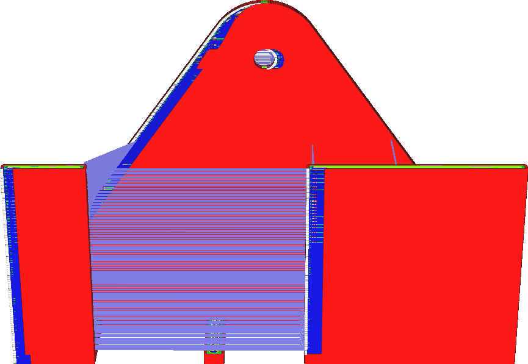

Activer la roue libre
====
Si ce réglage est activé, la buse arrêtera légèrement l'extrusion du matériau avant de refermer le contour d'une paroi. L'idée est que la chambre de la buse peut alors se vider sur le dernier morceau de ligne à cet endroit, ce qui réduit la pression sur la buse et permet de la bloquer par le début du contour. Cela permet de réduire la pression sur la buse et de la bloquer au début du contour.

L'activation de la roue libre vise à réduire la visibilité de la couture dans les murs. Si vous avez normalement de grosses coutures, l'activation de cette fonction peut réduire cet effet. C'est en gros le contraire de ce que fait la [Distance d'essuyage de la paroi extérieure](../shell/wall_0_wipe_dist.md), il est donc conseillé d'essayer de réduire l'essuyage avant d'essayer la roue libre.

La roue libre produira toujours une sous-extrusion, en théorie. Que cela soit visible ou non dans l'impression réelle dépend des circonstances. La roue libre est généralement plus efficace avec les imprimantes à entraînement direct. Si votre imprimante est équipée d'un entraînement direct, vous voudrez réduire le [Volume de roue libre](coasting_volume.md) à une valeur inférieure à celle obtenue avec des tubes Bowden ou des systèmes d'entraînement flexibles, car la réaction du débit est alors beaucoup plus rapide. Avec les systèmes d'alimentation de type Bowden, il sera également beaucoup plus difficile de contrôler le volume de roue libre pour réduire efficacement la visibilité de la couture.
