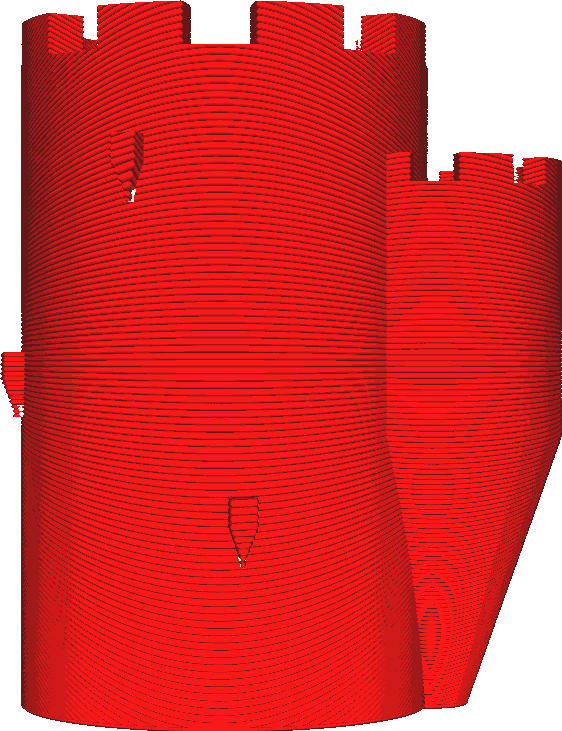

Angle maximal du modèle
===

Avec ce paramètre, l'angle de surplomb est configuré (en degrés) de manière à rendre le surplomb imprimable (conical_overhang_enabled.md). L'augmentation de cet angle permet d'obtenir un plus grand surplomb, ce qui fait que Cura modifie moins le modèle. Réduire cet angle permet de ne plus avoir de surplomb du tout.

Un angle de 90° laissera le modèle tel qu'il était avec tout son surplomb. Le modèle ne sera pas modifié. Un angle de 0° rendra toutes les pentes complètement verticales.

La réduction de cet angle réduit le surplomb du modèle. Cela permet de mieux imprimer le modèle. Il ne s'affaissera pas autant, et donc la surface des côtés inférieurs sera plus lisse. Cependant, cela rendra également l'objet imprimé moins fidèle au modèle original. Il faudra également un peu plus de temps et de matériel pour l'imprimer.

L'angle peut également être négatif. Cela rend l'ensemble de l'impression conique avec une large base. Cela peut produire des effets intéressants, mais n'a pas de réelle utilité pratique.
