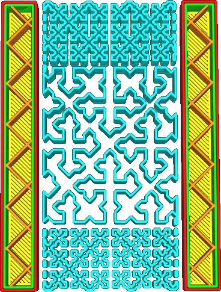
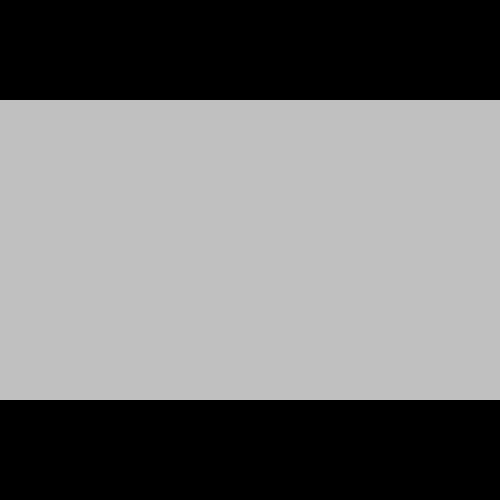

Dans ce paramètre, vous pouvez fournir une image qui spécifie la densité à différents endroits du support. La densité du support varie à certains endroits en fonction de la luminosité de l'image. Cela ne fonctionne que pour le [motif en croix](../support/support_pattern.md), car ce motif est capable d'ajuster sa densité sans croiser les lignes, ce qui entraînerait une interruption du flux et une réduction de la force.

Le chemin vers l'image est fourni comme un chemin local, par exemple `C:\Projects\3D Printing\support_density.png` sous Windows ou `/home/ghostkeeper/3d_printing/support_density.png` sous Unix. Les formats de fichiers supportés sont JPG, PNG, TGA, BMP, PSD, GIF, HDR et PIC. L'image est mise à l'échelle sur l'impression de telle sorte qu'elle s'adapte exactement à la boîte de la scène imprimée. La luminosité de l'image détermine la densité du support :
* Lorsque l'image est noire, la [Densité du support](../support/support_infill_rate.md) est utilisée.
* Si l'image est blanche, la densité de support sera proche de 0 %.

La densité de support ne dépassera jamais la valeur spécifiée par la [Distance d'écartement de ligne du support](../support/support_line_distance.md). Elle peut seulement être réduite. Le modèle est également limité dans les cas où il peut réduire sa densité. Bien qu'il essaie de se rapprocher le plus possible de la densité de support souhaitée, cela n'est pas toujours possible. Si la densité du support est vraiment faible, il y aura particulièrement peu de possibilités d'ajuster la densité du support, ce qui fera que l'impression suivra l'image de manière très lâche. Dans les endroits où la densité du support est élevée, l'image sera suivie de très près. La densité choisie est également fortement quantifiée. La densité peut seulement être doublée ou réduite de moitié, mais Cura [réalise une diffusion d'erreur](https://fr.wikipedia.org/wiki/Diffusion_d%27erreur) sur le motif afin d'obtenir une plus grande précision effective.

Avec ce réglage, vous pouvez personnaliser votre support très loin. Si certaines parties de votre impression sont susceptibles de s'affaisser ou doivent être imprimées avec une grande précision, vous pouvez augmenter localement la densité à cet endroit pour mieux les soutenir, sans avoir à prendre un grand coup dans le temps d'impression ou à rendre le support plus difficile à enlever.  

**Ce paramètre ne se transférera pas bien à travers les fichiers du projet Cura. Le fichier de projet enregistrera le chemin d'accès à l'image comme valeur de réglage, mais ne stockera pas l'image. Si le fichier de projet est ouvert sur un autre ordinateur, l'image de densité ne sera probablement pas restaurée.**

