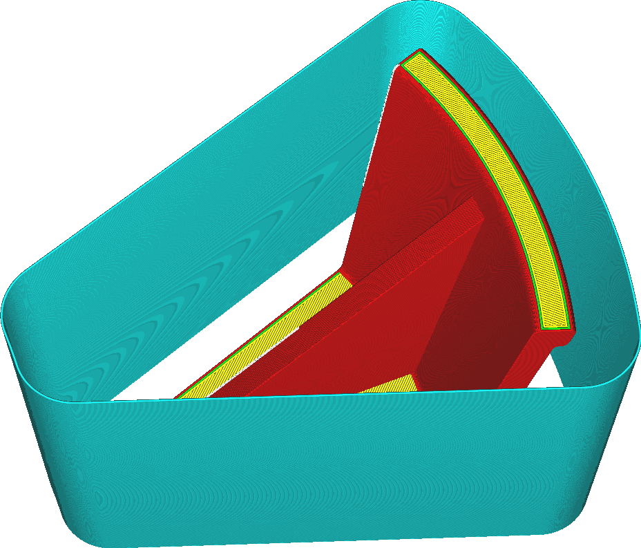

Lorsque ce paramètre est activé, l'imprimante construit autour de votre impression une enveloppe qui la protège des courants d'air provenant de l'environnement.

Certaines imprimantes et certains matériaux d'impression sont très sensibles à l'environnement dans lequel ils sont imprimés. Imprimer à différents endroits de la plaque de construction peut conduire à des résultats différents car ils sont plus sensibles aux courants d'air venant de l'extérieur. Si l'impression est laissée en marche pendant la nuit et que la pièce se refroidit, cela peut avoir un impact important sur l'impression. Le paravent vise à réduire cet effet en créant un petit volume isolé autour de l'impression. Celui-ci sert de "chambre chauffée" de fortune pour garder l'impression au chaud et la protéger des courants d'air froid venant de l'extérieur.

Le paravent est imprimé sur place au fur et à mesure de l'impression du modèle. Si plusieurs extrudeuses sont impliquées dans l'impression, le paravent sera imprimé en utilisant l'extrudeuse qui démarre la couche. Celle-ci alternera d'une couche à l'autre.

Le paravent a plusieurs effets majeurs sur l'impression :
* Il maintient la température de l'impression plus constante. C'est l'effet recherché du paravent. Par conséquent, les bandes dues aux variations de température dans la pièce devraient être réduites.
* En général, la température à l'intérieur du paravent est plus élevée que s'il n'y avait pas de paravent. En effet, la chaleur a plus de mal à s'échapper et il ne peut y avoir de courants de convection qui s'élèvent avec l'air chaud de l'impression. Cela a un effet sur tous les aspects de l'impression. En particulier, il y aura plus de ficelles et d'affaissement.
* Les ventilateurs de la tête d'impression seront moins efficaces. Le bouclier perturbe également la circulation de l'air à cet endroit. Pour augmenter l'efficacité des ventilateurs sur la tête d'impression, la [distance](draft_shield_dist.md) du paravent peut être augmentée.
* Le paravent peut être doublé en tant que [bouclier anti-humidité](../dual/ooze_shield_enabled.md). Si les déplacements se font vers un objet protégé par un paravent, tout suintement restant sur la buse sera essuyé sur le paravent.
* Le paravent peut servir de [Prime Tower](../dual/prime_tower_enable.md). Comme il est imprimé avant l'objet, l'impression du paravent est un moyen de purger le matériau et de le faire couler correctement. Cette méthode n'est cependant efficace qu'avec deux extrudeuses, car toutes les extrudeuses ne sont pas purgées s'il y en a plus de deux.
