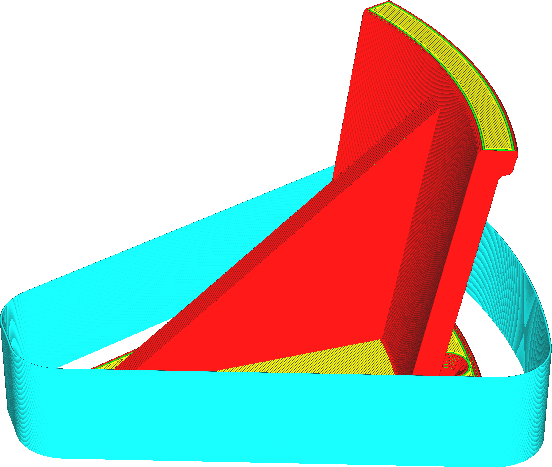

Hauteur du bouclier
====
Si le paramètre [Limite du bouclier](draft_shield_height_limitation.md) est réglé sur "Limited", ce paramètre vous permet de spécifier à quelle hauteur le paravent doit être limité.

La face inférieure de l'impression tend à être la plus sensible aux fluctuations de température. C'est là que la plupart des déformations se produisent si la pièce est froide, et ces déformations peuvent faire que le tirage se détache de la plaque de montage. Avec ce réglage, vous pouvez choisir la hauteur qui limitera l'impression. Abaisser la hauteur du paravent peut faire gagner du temps et économiser de la matière. Le paravent protégera alors toujours la face inférieure de l'impression et bloquera également la convection de l'air due à la montée de l'air chaud (dans une certaine mesure).

Le paravent ne peut jamais être imprimé plus haut que l'objet lui-même.
