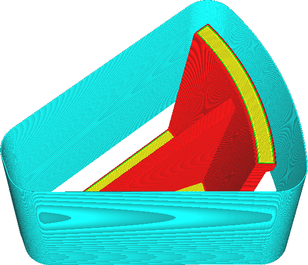

Limite du bouclier
====
Le paravent peut être imprimé soit sur toute la hauteur du modèle, soit seulement sur une hauteur spécifique. Ce paramètre vous permet de choisir la hauteur du paravent.

La face inférieure de l'impression tend à être la plus sensible aux fluctuations de température. C'est là que la plupart des déformations se produisent si la pièce est froide, et ces déformations peuvent faire que le tirage se détache de la plaque de montage. Avec ce réglage, vous pouvez choisir de limiter la hauteur du paravent à une certaine hauteur. Cela peut vous faire gagner du temps et économiser du matériel. Le paravent protégera alors toujours la face inférieure de l'impression et bloquera également la convection de l'air due à la montée de l'air chaud (dans une certaine mesure).

Le paravent ne peut jamais être imprimé plus haut que l'objet lui-même.
