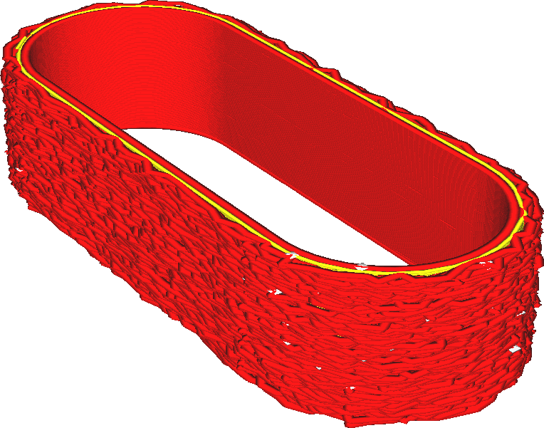

Si ce paramètre est activé, l'effet [fuzzy skin](magic_fuzzy_skin_enabled.md) ne sera appliqué qu'aux murs extérieurs de l'impression.

Une peau floue peut être un bel effet pour donner de la texture au modèle ou augmenter son adhérence, mais elle détruit complètement toute précision dimensionnelle que vous pourriez attendre de l'impression. C'est un problème si l'empreinte doit être montée sur quelque chose, comme une poignée ou quelques vis. Dans ce cas, vous pouvez désactiver l'effet de peau floue sur les contours intérieurs de l'empreinte, en la limitant aux seuls côtés extérieurs.
