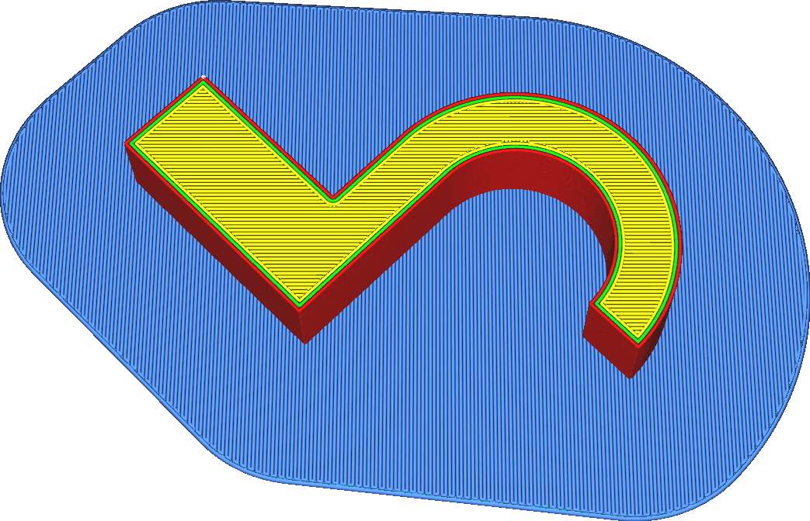

Supprimer les coins intérieurs du radeau
====
Lorsque ce paramètre est activé, tous les angles intérieurs du radeau sont complètement supprimés, transformant le radeau en une [forme convexe](https://en.wikipedia.org/wiki/Convex_set). Le radeau n'aura plus que des coins extérieurs.

<!--screenshot {
"image_path": "raft_remove_inside_corners.png",
"models": [{"script": "microwave_hook.scad"}],
"camera_position": [59, 59, 200],
"settings": {
	"adhesion_type": "raft",
	"raft_remove_inside_corners": true
},
"colours": 64
}-->

Cela revient à avoir un [lissage](../platform_adhesion/raft_smoothing.md) très élevé . La suppression des coins intérieurs du radeau a un certain nombre d'effets :
* Il n'est plus possible qu'une petite partie du radeau dépasse largement du reste du radeau. Les petites parties du radeau sont plus susceptibles de se détacher de la plaque de construction, en particulier avec les matériaux à forte déformation. La suppression des coins intérieurs réduit cet effet, rendant l'impression plus fiable.
* Le rouleau est plus grand, ce qui augmente la force d'adhésion totale à la plaque de construction.
* L'impression de la grille prend plus de temps et utilise plus de matériau.