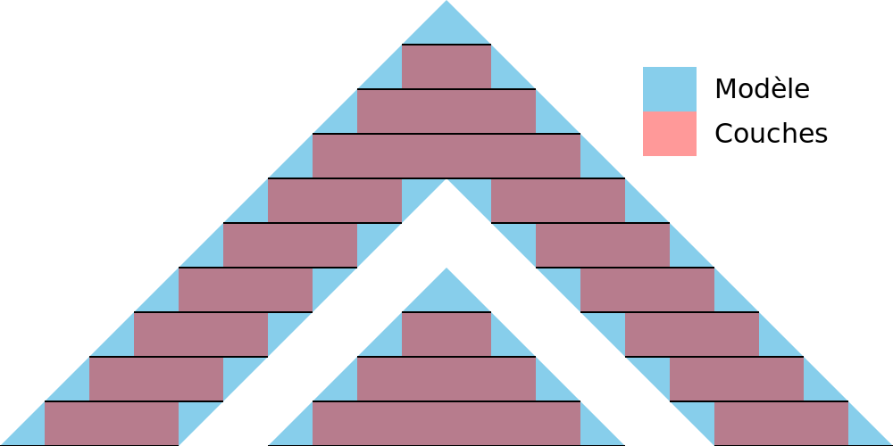

Tolérance à la découpe
====
Grâce à la tolérance de découpage, vous pouvez ajuster la manière de traiter l'imprécision de la subdivision d'une maille en un nombre fini de couches. Elle vous permet de choisir si les couches doivent se rapprocher de la surface, rester délimitées par la surface ou inclure la surface complètement.

Milieu
----

En utilisant le milieu, les couches resteront aussi proches que possible de la surface d'origine. Cela signifie que les couches vont parfois dépasser de la surface d'origine et parfois s'enfoncer dans la surface d'origine. Dans l'ensemble, le volume des couches correspondra très étroitement au volume du maillage d'origine.

Pour obtenir la tolérance moyenne, Cura calculera une section transversale à mi-chemin de l'épaisseur de chaque couche. Tout ce qui se trouve à l'intérieur de la section transversale fera partie de la couche.

Inclusif
----

Lorsque vous utilisez Inclusive, les couches contiennent *au moins* la totalité du volume original. Lorsque la surface est inclinée, les couches seront légèrement en saillie. Le volume total des couches sera presque toujours supérieur au volume de la maille originale.

Pour obtenir la tolérance Inclusive, Cura calculera les sections transversales en haut et en bas de la hauteur de chaque couche. Toutes les surfaces qui se trouvent dans *l'une ou l'autre* de ces sections transversales seront considérées comme faisant partie de cette couche. Les petits détails qui se situent entre les deux sections transversales seront toujours ignorés, étant inférieurs à la hauteur d'une couche.

Exclusif
----

En cas d'utilisation d'Exclusive, les couches seront contenues dans le volume original. Lorsque la surface est inclinée, les couches seront légèrement plus petites que le volume original. Le volume total des couches sera presque toujours inférieur au volume de la maille originale.

Pour obtenir la tolérance Exclusive, Cura calculera les sections transversales en haut et en bas de la hauteur de chaque couche. Seules les surfaces qui se trouvent à l'intérieur de ces*deux* sections transversales seront considérées comme faisant partie de cette couche.

Utilisation
-----
Ce paramètre porte le nom de son utilisation prévue plutôt que de son effet fonctionnel. Si vous avez plusieurs pièces qui doivent glisser les unes sur les autres, la forme théorique des couches peut physiquement empêcher un ajustement exact. Dans un tel cas, vous pouvez régler ce paramètre sur **Exclusif** afin de garantir que les couches restent dans les limites du volume original. À l'exception du gauchissement, de l'affaissement et d'autres effets de déformation similaires, cela garantira que les pièces s'emboîtent les unes dans les autres et puissent glisser les unes sur les autres.

En réalité, il y a toujours d'autres effets qui empêchent cela. Dans la pratique, ce réglage peut être utilisé pour obtenir une tolérance légèrement plus ou moins grande entre deux surfaces inclinées, comme on peut le voir sur les images ci-dessus.
