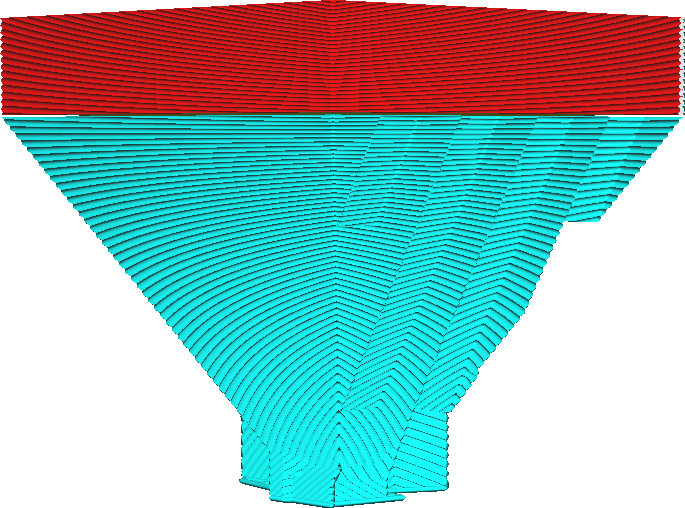
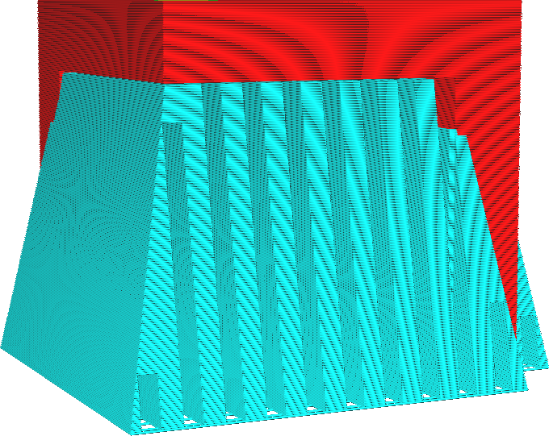

Angle des supports coniques
====
Ce réglage détermine l'angle de la pente à laquelle le support conique est imprimé.

L'angle de soutien conique est le compromis le plus important entre la stabilité du soutien et le montant du soutien généré.

L'utilisation d'un grand angle rendra le support très mince sur une grande partie de sa hauteur. Cela permet d'économiser beaucoup de matière de support et de temps d'impression. Lorsqu'il faut beaucoup de matière de support, cela permet d'économiser beaucoup de temps et de matière, car jusqu'à la moitié du support est laissée de côté. Cependant, comme le support devient très mince en bas, il peut aussi devenir moins stable, ce qui augmente le risque d'échec de l'impression. Vous pouvez augmenter la [largeur minimale](support_conical_min_width.md) pour éviter cela.

L'utilisation d'un angle négatif rendra le support plus large vers le bas, en forme de volcan. Si votre tirage comporte des éléments minuscules en hauteur qui doivent être soutenus, ils produiront normalement de très hautes [tours](../support/support_use_towers.md) qui auront tendance à tomber pendant le tirage. Avec un angle négatif, ces hautes et minces structures de support seront élargies dans le bas. Cela leur donne une certaine stabilité supplémentaire. Cependant, l'impression de ce support prendra plus de temps car il nécessite plus de matière. Un angle d'environ -5° est normalement suffisant pour donner aux structures de support les plus hautes et les plus minces une stabilité suffisante. Si votre matériau a tendance à suinter beaucoup lors des déplacements, un angle négatif plus important sera nécessaire car la structure sera davantage poussée en raison des taches sur le support.
