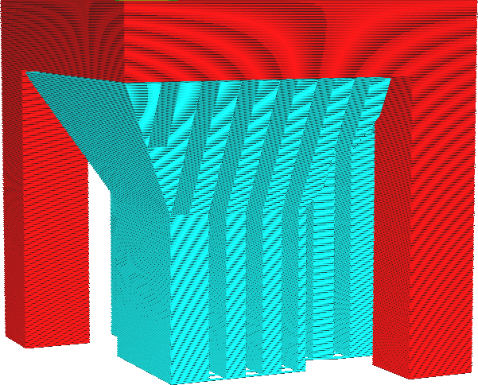

Si le support conique est activé et réglé pour rétrécir la structure de support, ce réglage détermine la largeur minimale à laquelle le support conique rétrécira le support. Le support ne s'amincit que si la zone en surplomb qui doit être soutenue est déjà plus mince.

Si un grand volume de soutien repose sur un minuscule pilier de soutien, ce soutien sera très susceptible de tomber. L'augmentation de la largeur minimale augmente la largeur du pilier de soutien de base vers lequel le cône va graviter. Cela augmente la fiabilité de l'impression, mais coûtera du matériel supplémentaire. Dans l'ensemble, le support conique sera moins efficace pour réduire le temps d'impression.
