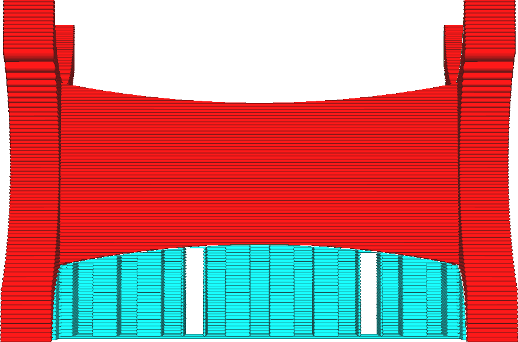

Démantèlement du support en morceaux
====
Si le [motif](../support/support_pattern.md) est utilisé comme support, le support peut être froissé afin de pouvoir le retirer facilement. Cela devient plus difficile si le support est très large. Avec ce réglage, le support en zigzag est brisé en morceaux qui sont plus faciles à détacher individuellement, mais qui restent suffisamment larges pour maintenir leur stabilité.

En cassant le support en morceaux, il est plus facile de le détacher, car vous pouvez le casser une pièce à la fois. Cela réduit cependant légèrement la résistance et la rigidité du support, surtout si la [taille du morceau](support_skip_zag_per_mm.md) est réglée pour être très petite. Par conséquent, le risque de chute du support est légèrement plus élevé, ce qui entraîne beaucoup de cordes et de mauvais porte-à-faux.

Ce réglage empêche également de retirer tout le support en une seule pièce. S'il y a plusieurs supports, il faut les enlever individuellement. Si le support se détache assez facilement, ce réglage peut en fait rendre l'enlèvement du support plus difficile (bien que cela puisse être plus facile).
