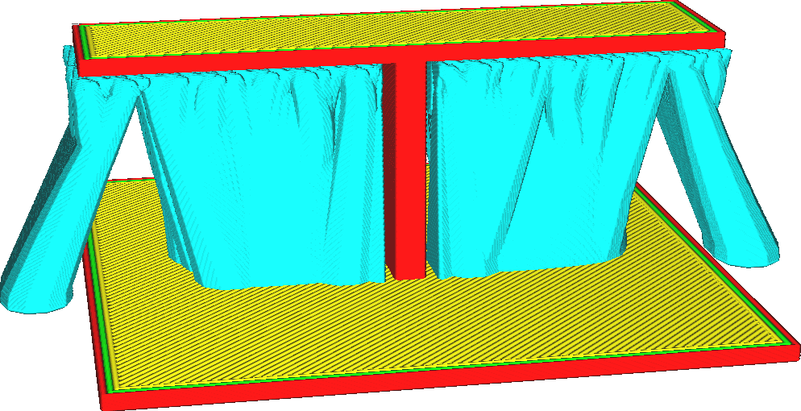

Ce réglage détermine l'angle de surplomb maximum que les branches de l'arbre de support sont autorisées à faire. Si l'angle est augmenté, les branches peuvent être imprimées plus horizontalement, ce qui leur permet d'aller plus loin.

La réduction de l'angle de la branche rendra les branches plus verticales. L'augmenter les rendra plus horizontales. Comme les branches peuvent avoir des angles de surplomb plus importants, elles peuvent atteindre des obstacles plus éloignés, ce qui permet au support de reposer plus souvent sur la plaque de construction plutôt que sur le modèle. Cela permettra également aux branches de se détacher plus tard.

Les effets les plus importants de l'augmentation de l'angle des branches pour le support des arbres sont les suivants :
* Réduction des cicatrices, car le support doit moins souvent reposer sur le modèle plutôt que sur la plaque de construction. Si le [positionnement des supports](../support/support_type.md) est réglé sur en contact avec le plateau, une plus grande partie du modèle peut être supportée.
* Réduction du temps d'impression et de l'utilisation des matériaux, en raison de la séparation des branches à des altitudes plus élevées. Les branches sont coupées juste à temps pour pouvoir atteindre tout le surplomb.
* Fiabilité réduite. Si l'angle du surplomb devient trop important, le support sera fortement affaibli, ce qui augmentera le risque que le support se brise ou bascule.

Il est préférable de combiner les grands angles de branches avec des valeurs faibles pour le paramètre [Tree Support Collision Resolution](support_tree_collision_resolution.md). Cela permettra de réduire les décalages dans les positions de l'arbre en raison de l'évitement des collisions. Cela évite que la distance de surplomb ne devienne trop importante lorsque la distance de collision est ajustée.
