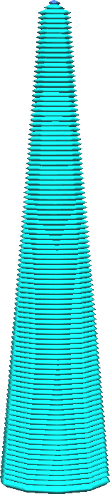
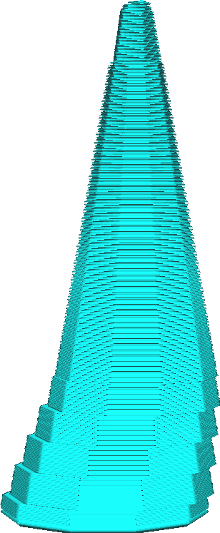

The branches of tree support are wider towards the bottom than they are at the top. This ensures that the branches remain stable no matter how tall the support gets. With this setting, you can control the rate at which the support gets wider.

The greater the angle, the wider the bottom of the tree support will become, especially with tall models. This has several effects:
* The wider bottom ensures that the support is harder to topple. This increases the reliability of the tree support.
* The wider bottom takes more material and time to print.
* The support angle adds up to the maximum [angle](support_tree_angle.md) at which the branches can overhang, so very high values may cause the tree support to be less sturdy as well in some cases.
* The wider branches have a harder time navigating around the mesh, making it harder to reach some parts of overhang from the build plate. As a result, the support may need to rest on the model instead of on the build plate, increasing the amount of scarring.
* The collision avoidance of the tree is harder to calculate for Cura, resulting in increased slicing time. This can be counteracted by increasing the [Tree Support Collision Resolution](support_tree_collision_resolution.md) setting, but that reduces the structural integrity of the tree support as well.

In general, you'll want the angle to be such that the tree support is just wide enough to support itself at any height without becoming too wobbly.