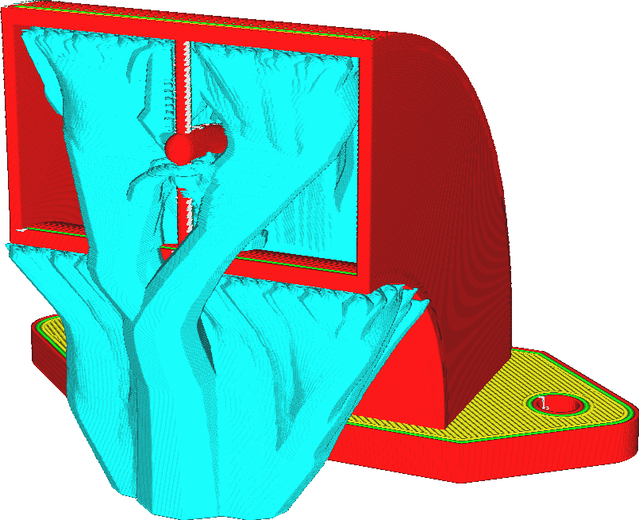

Support arborescent
====
Les support arborescent offrent une approche alternative au support du modèle que la technique de support ordinaire. Le support arborescent génère une structure ramifiée qui commence sur la plaque de construction avec une petite base, mais qui se développe vers les parties qui ont besoin d'être soutenues.

Les supports arborescents permettent d'éviter les obstacles lors de la croissance vers les zones en surplomb. Dans la mesure du possible, l'arbre poussera à partir de la plaque de construction vers le haut afin d'éviter les cicatrices sur la surface sur laquelle le support repose. Si cela n'est pas possible, l'arbre reposera sur la surface du modèle aussi près que possible du surplomb afin de minimiser le temps et l'utilisation de matière. Les branches du support de l'arbre sont limitées par l'[Angle des branches de support arborescent](../support/support_tree_angle.md) afin qu'elles ne produisent pas une dépouille trop abrupt pour eux même. Cela limite la capacité de croissance autour des obstacles et détermine également la hauteur à laquelle les troncs commenceront à se ramifier.

Le support de l'arbre est creux par défaut. Toutefois, les paramètres de support ordinaires s'appliquent toujours à la zone délimitée par les branches de l'arbre. En particulier, la [Densité du support](../support/support_infill_rate.md) peut être utilisée pour donner au support une plus grande résistance structurelle. Comme la nature des supports arborescent est très irrégulière, ils ont normalement une grande rigidité pour remplir leurs fonctions.

Les support arborescent présente un certain nombre d'avantages par rapport à un support normal, pour n'en citer que quelques-uns :
* Le support arborescent utilise généralement beaucoup moins de matériau que le support ordinaire. Entre 25 et 50 % de l'utilisation de la matière est typique. Cela permet d'économiser beaucoup de temps et de coûts en matière.
* Lorsqu'il est imprimé avec le même matériau que l'impression, le surplomb a tendance à être plus esthétique avec un support en forme d'arbre.
* Le support en forme d'arbre est plus facile à enlever que le support ordinaire.
* Le support en forme d'arbre laisse moins de cicatrices sur la surface que le support normal, car il permet d'atteindre la plaque de construction autour du modèle.

Cependant, cela présente également quelques inconvénients :
* Le support en forme d'arbre prend plus de temps à découper. La patience sera nécessaire, surtout avec les modèles de grande taille.
* Il y a beaucoup d'interruptions dans le flux lorsque les plus petites branches sont imprimées, ce qui rend le support arborescent impropre à l'impression avec des matériaux difficiles à extruder, comme le PVA ou les matériaux flexibles.
* Le support arborescent ne fonctionne pas très bien pour supporter certains modèles mécaniques. En particulier, il a tendance à placer trop peu de branches pour supporter des surplombs plats et inclinés.

**Note sur les versions antérieures à Cura 4.8**

Bien que le support arborescent puisse être activé en même temps que le support ordinaire sur les anciennes versions, ce n'est généralement pas souhaitable. Les deux types de support se croiseront et provoqueront une surextrusion.
