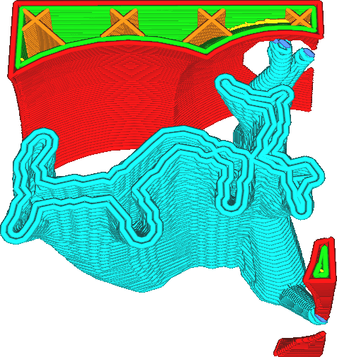

This setting determines how thick the tree support's perimeter will be. For a thicker perimeter, more contours will be drawn in the shape of the tree.

Thicker walls will make the support much more sturdy, especially with large [angles of the branches](support_tree_angle.md). This increases reliability of the print, reducing the chance for the branches of the support to break.

However it will also greatly increase the time and material spent on the support.

This setting works very similar to the [Support Wall Line Count](../support/support_wall_count.md) setting.