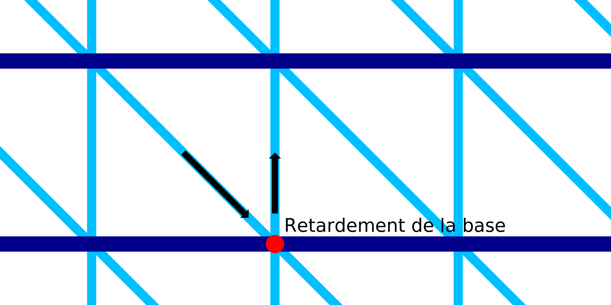

Attente pour le bas de l'impression filaire
===

Avec ce réglage, la buse s'arrête un instant après avoir imprimé une ligne diagonale vers le bas.

Lorsque la buse est immobile, elle continue à suinter un peu de matière et produit une tache à cet endroit. Cette goutte aide à fixer le motif en dents de scie à l'anneau horizontal situé en dessous. Il améliore la résistance et la fiabilité de l'impression.

Cependant, l'ajout d'un délai augmente considérablement le temps d'impression. Il y a beaucoup d'endroits où la buse s'arrêtera alors.
