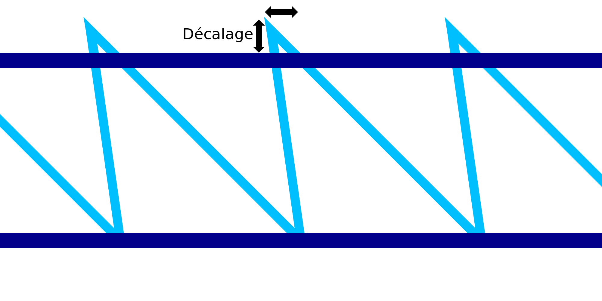

Entraînement de l'impression filaire
===

Lors de l'impression du mouvement diagonal vers le bas du motif en dents de scie pour l'impression au fil de fer, le matériau a tendance à être un peu traîné. Ce réglage compense cet effet en transformant légèrement la forme du motif en dents de scie. Les pointes des dents sont amenées vers le haut et vers l'arrière.

Les pointes des dents sont déplacées exactement à l'opposé du mouvement diagonal vers le bas. Au fur et à mesure que le matériau est entraîné, on espère que les pointes des dents de scie se retrouvent à l'endroit prévu.

Si le réglage est bon, l'impression en dents de scie est plus précise. Par conséquent, l'anneau horizontal suivant qui est placé sur le motif en dents de scie ne s'affaissera pas autant qu'il le ferait autrement. L'ensemble de la structure devient plus solide et l'impression est plus fiable.
