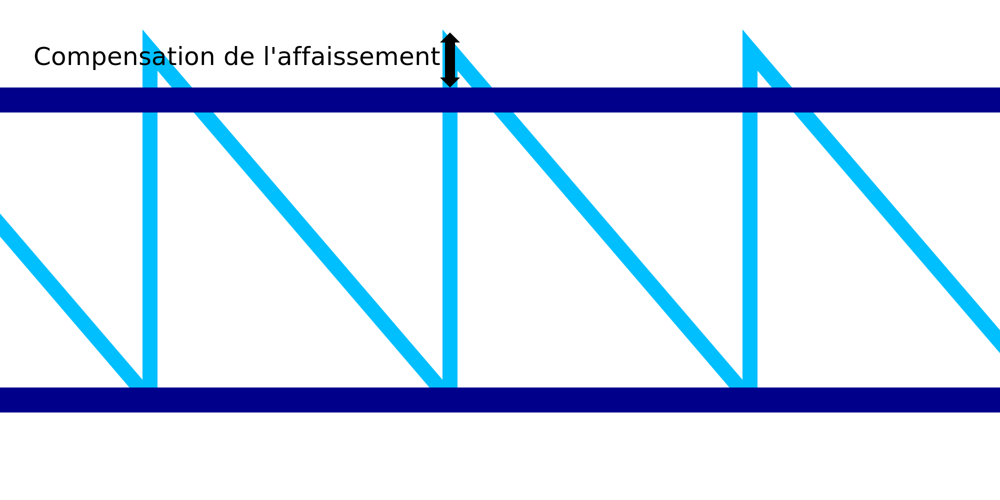

Descente de l'impression filaire
===

Lors de l'impression du cadre métallique, on s'attend à ce que le matériau s'affaisse en raison de la chaleur latente avant qu'il ait le temps de se solidifier. Cela rendrait le motif en dents de scie trop court. Alors que les anneaux horizontaux sont capables de se chevaucher grâce au mouvement horizontal continu, le motif en dents de scie ne le peut pas. Ce réglage compense la courte taille du motif en dents de scie, rendant le motif légèrement plus grand pour que l'anneau horizontal suivant repose correctement sur lui.

La valeur du réglage est ajoutée à la hauteur des dents de la scie. On espère ainsi compenser l'affaissement lors de l'impression de ces dents de scie. S'il est bien réglé, l'anneau horizontal sera imprimé en reposant fermement sur le dessin des dents de scie, au lieu de tomber plus bas que la hauteur imprimée prévue.

Lorsqu'il est combiné avec l'[Entraînement de l'impression filaire](./wireframe_drag_along.md), la hauteur du motif en dents de scie devient la [hauteur](./wireframe_height.md) normale plus la valeur du paramètre Drag Along plus la valeur de ce paramètre.
