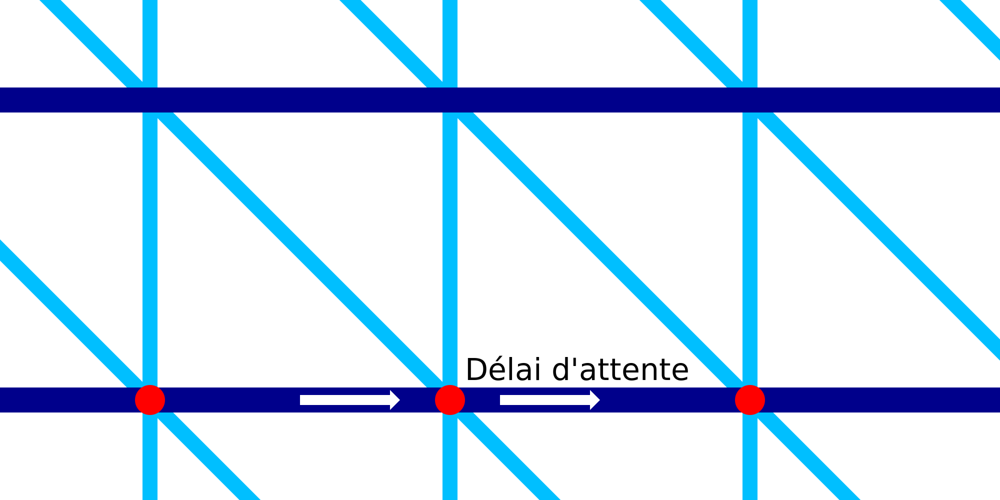

Attente horizontale de l'impression filaire
===

Pendant l'impression des anneaux horizontaux du cadre métallique, la buse s'arrête pendant une fraction de seconde à chaque segment de ligne. Ce réglage permet de configurer la durée de cette pause. La pause est située exactement à l'endroit où l'anneau horizontal se raccorde au motif en dents de scie qui se trouve en dessous.

En s'arrêtant complètement et en faisant une pause, une petite goutte de matière suintante apparaîtra aux endroits où la buse s'arrête. La pression du flux de matière sortant de la chambre de la buse poussera également l'anneau horizontal légèrement vers le bas. L'anneau est ainsi très bien fixé au motif en dents de scie situé en dessous.

La pause augmente fortement le temps total d'impression. Il existe de nombreux endroits où la buse est mise en pause.
