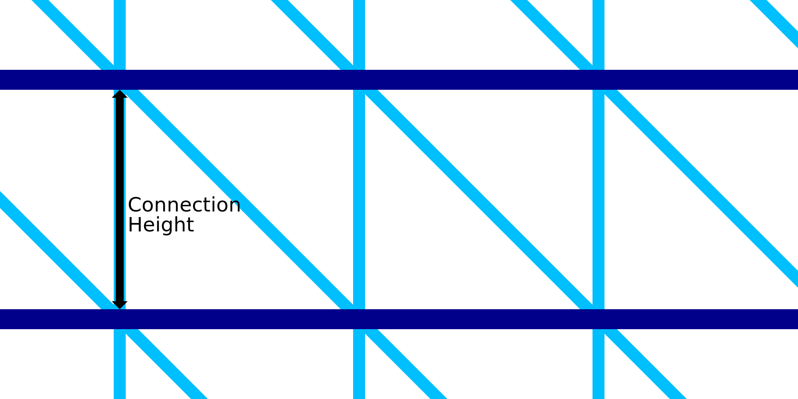

Hauteur de connexion pour l'impression filaire
====
L'impression au fil de fer consiste à imprimer un certain nombre d'anneaux autour du contour. L'espacement vertical des anneaux est déterminé par ce réglage. Avec ce réglage, vous pouvez définir la longueur des connexions entre deux anneaux concentriques.

Les anneaux sont reliés par un motif en dents de scie. Celui-ci se compose d'une ligne verticale ainsi que d'une ligne diagonale. La ligne verticale sera exactement la longueur de la connexion. La ligne diagonale sera inclinée à 45°. Par conséquent, ce réglage détermine non seulement la hauteur verticale entre les anneaux, mais aussi la taille horizontale du motif en dents de scie. Il déterminera la densité du cadre en général.

La réduction de la hauteur rendra le cadre plus dense. Elle rendra le cadre plus stable et rendra l'impression plus fiable. Toutefois, l'impression prendra également plus de temps.
