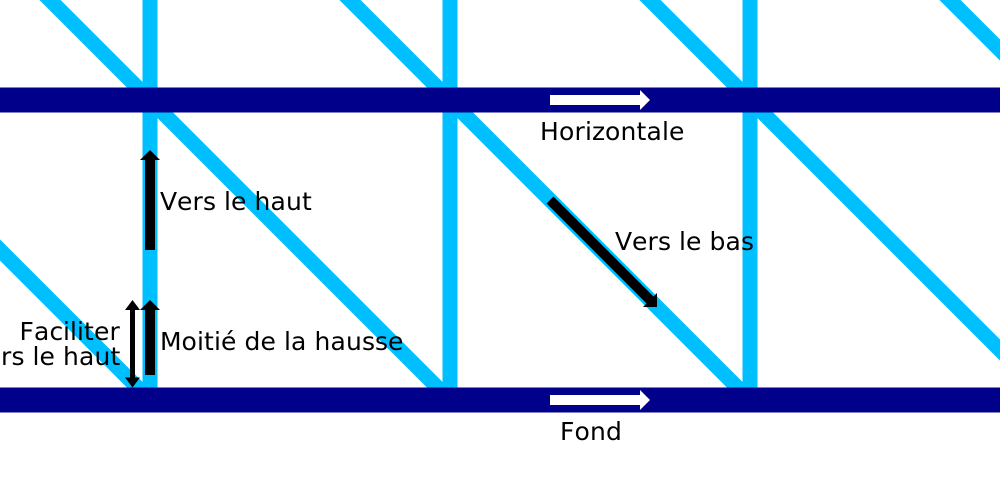

Vitesse d’impression filaire du bas
===

Ce réglage permet de configurer la vitesse d'impression des anneaux concentriques sur la couche initiale de l'impression lors de l'utilisation de l'impression au fil de fer. La vitesse d'impression de la couche initiale plane peut être configurée séparément du reste des couches horizontales.

Pour la première couche plane, la technique d'impression au fil de fer ne devra pas faire de pont. Selon les propriétés de solidification de votre matériau et la vitesse de ventilation de votre imprimante, la vitesse inférieure peut être imprimée un peu plus lentement que le reste des couches plates.
