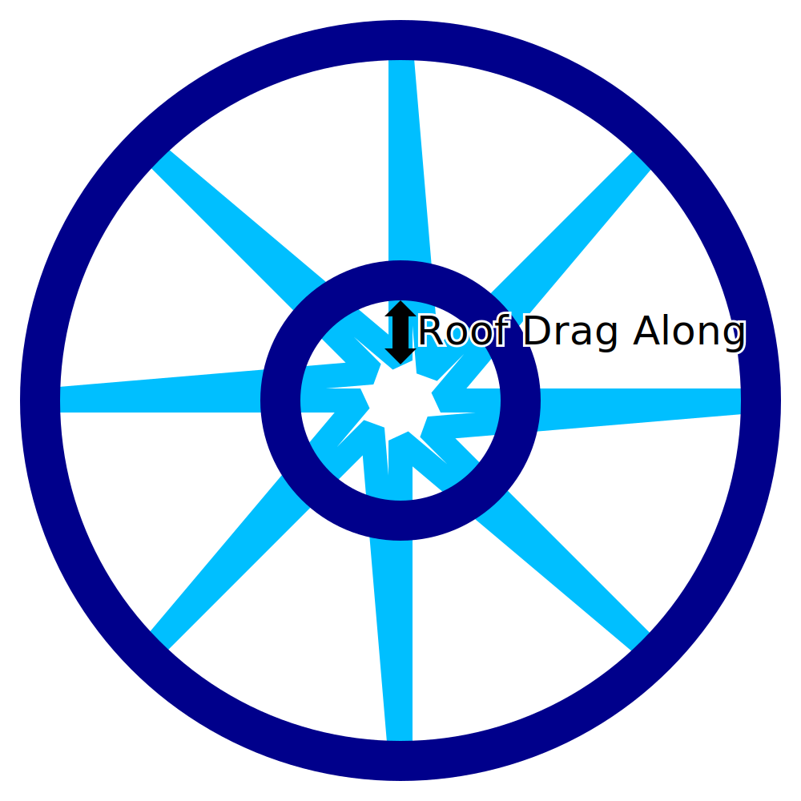

When printing molten plastic, the nozzle tends to pull some of the material along with its motion even after it's been extruded. This effect is even stronger when printing in mid-air for the roof of the wire frame when printing for Wire Printing mode. This setting causes the saw-tooth pattern at the top of the print to be continued a bit deeper inwards to compensate for it being dragged along with the nozzle.

This setting causes the inner tips of the saw-tooth pattern in the top side of the print to be moved further inwards. The tips are moved in the exact opposite direction of the diagonals that move outward, not the straights that move inwards.

With careful tuning, the objective of this setting is to improve the attachment of the inner tips of the saw-tooth pattern to the concentric ring that is printed to rest upon them.