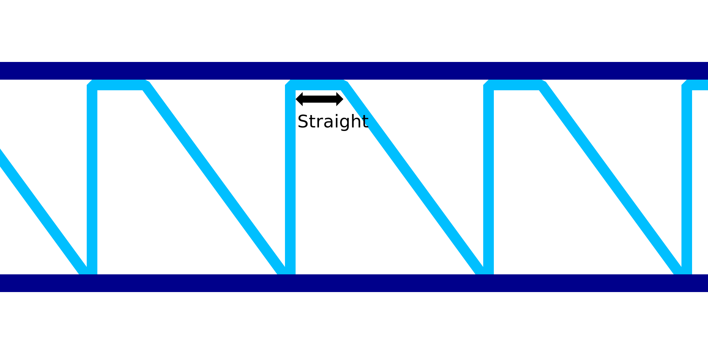

Redresser les lignes descendantes de l'impression filaire
====

Ce réglage est un autre facteur de compensation qui peut être appliqué pour compenser l'affaissement du matériau pendant l'impression au fil de fer. Au lieu de se déplacer directement en diagonale vers le bas pour le motif en dents de scie, ce réglage fera en sorte que la buse se déplace horizontalement pour une longueur de fil donnée, puis se déplace vers le bas.

Le mouvement horizontal droit a pour but de tirer le matériau vers le haut avant de le faire descendre. S'il est correctement réglé, il fait descendre le matériau en diagonale droite plutôt qu'en courbe affaissée. Cela rend le motif en dents de scie plus fort et permet également aux extrémités des dents de mieux se relever pour soutenir l'anneau horizontal suivant.
