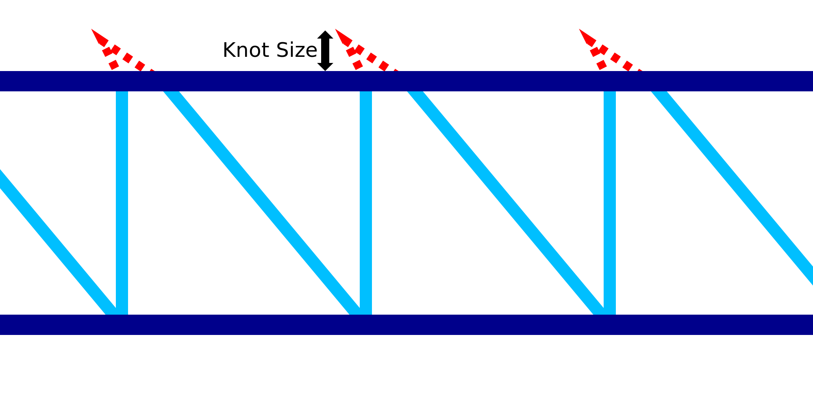

Stratégie de l'impression filaire
===

La préoccupation la plus importante pour la fiabilité de l'impression au fil de fer concerne les points de connexion où les couches de la trame se connectent les unes aux autres. Il existe plusieurs stratégies pour rendre ces connexions plus solides. Ce paramètre vous permet de choisir la stratégie que l'imprimante utilisera.

Compenser
----
En utilisant cette stratégie, l'imprimeur essaiera de compenser les facteurs d'affaissement du matériau. Comme le matériau sort fondu de la buse, il tombera un peu avant de se solidifier et sera entraîné par les mouvements de la buse. Cette stratégie déforme le motif en dents de scie qui relie les couches du cadre de telle sorte qu'il finit, espérons-le, par se retrouver au bon endroit.

Deux facteurs de compensation sont disponibles : L'un déforme le motif en dents de scie uniquement verticalement pour [compenser l'affaissement](wireframe_fall_down.md), et l'autre déforme le motif en dents de scie dans une direction diagonale pour [compenser le matériau entraîné](wireframe_drag_along.md) avec la buse.

Nœud
----
Lorsque cette stratégie est choisie, un petit mouvement vers le haut et vers l'arrière sera effectué au sommet de chaque dent de scie pour y former un "nœud" de matière. Le but de ce nœud est de donner à l'anneau horizontal qui le surmonte une certaine surface à attacher au motif de la dent de scie. Le nœud variera un peu d'un côté à l'autre, de sorte que si l'anneau horizontal n'est pas placé avec précision, il y a encore plus de chances qu'ils s'attachent l'un à l'autre. De plus, le nœud fera en sorte que la ligne ascendante s'étende un peu plus vers le haut, ce qui fera que l'anneau horizontal sera poussé par-dessus. Enfin, le nœud produira également un certain suintement en raison de l'absence de rétraction dans ce mouvement de déplacement. Cela produit une tache sur laquelle l'anneau horizontal peut mieux reposer.

La motion pour ce "nœud" est une série de mouvements de voyage :
1. Tout d'abord, la buse se déplace légèrement vers le haut et vers l'arrière.
2. S'il y a un [retard](wireframe_top_delay.md) dans la partie supérieure, la buse s'arrête pendant la durée du retard. Cette pause se fait dans la pointe du mouvement du nœud.
3. 3. Troisièmement, la buse redescend à la hauteur habituelle. En même temps, la buse avance et s'éloigne de la ligne verticale.

Rétraction
----
Lorsque cette stratégie est choisie, le matériau sera rétracté après chaque mouvement vers le haut pendant l'impression du motif en dents de scie. L'idée est qu'en rétractant le matériau, le fil est rompu. Cela réduit l'effet de traînage du matériau lors du mouvement de la buse, car le fil précédent n'est plus attaché à la buse. Ensuite, la buse fait un petit saut d'un millimètre et continue son mouvement diagonal vers la couche inférieure.

Un inconvénient majeur de cette stratégie est que la ligne diagonale vers le bas n'est plus non plus attachée à la buse. Cela rend effectivement inutile l'extrusion pendant cette ligne. Le matériau finit simplement par former une tache sur la couche inférieure. Le matériau est également soumis à un broyage plus important car il est rétracté d'avant en arrière sans qu'il y ait beaucoup d'extrusion entre les deux. Tout cela prend également beaucoup de temps.
