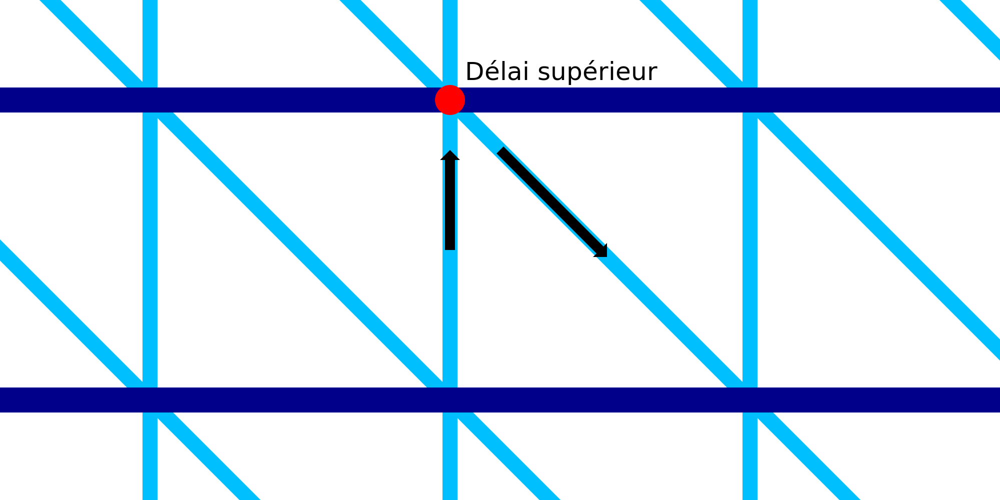

Attente pour le haut de l'impression filaire
====
Avec ce réglage, la buse s'arrête un instant après l'impression d'une ligne ascendante.

Alors que la buse reste immobile au sommet de la ligne ascendante, la ligne ascendante a le temps de se solidifier. Cela permet d'éviter qu'elle ne soit entraînée avec la buse lorsqu'elle recommence à descendre.

Bien sûr, l'ajout d'un délai augmente considérablement le temps d'impression. À l'arrêt, la chaleur de la buse peut également faire fondre le matériau et il suinte par le haut. Cela ajoute une goutte de matériau fondu sur une seule ligne de filament, ce qui rend cette ligne un peu lourde.

Ce réglage ajoute à l'empreinte un conglomérat de facteurs difficiles à prévoir. Le délai précis qui convient le mieux à votre matériau, à votre imprimante et à votre modèle doit être déterminé expérimentalement. En général, l'augmentation du délai dans des limites raisonnables a tendance à avoir un impact positif sur la fiabilité de l'impression, mais un impact négatif important sur la vitesse d'impression.
