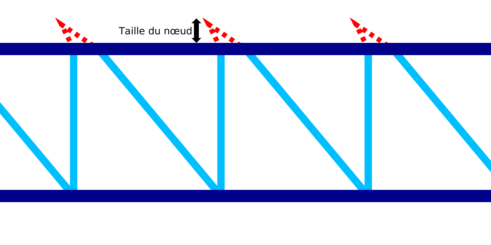

Taille de nœud de l'impression filaire
===

Si la [Stratégie d'impression par fil](./wireframe_strategy.md) est réglée sur "Nœud", un petit mouvement de haut en bas et de bas en haut sera effectué au sommet de chaque dent de scie. Ce réglage permet de configurer l'ampleur de ce mouvement.

La motion pour ce "nœud" est une série de mouvements de voyage :
1. Tout d'abord, la buse se déplace vers le haut de la distance indiquée par ce réglage. En même temps, la buse se déplace vers l'arrière sur la moitié de cette distance.
2. S'il y a un [retard](./wireframe_top_delay.md) dans la partie supérieure, la buse s'arrête pendant la durée du retard réglé. Cette pause se fait dans la pointe du mouvement du nœud.
3. 3. Troisièmement, la buse redescend à la hauteur habituelle. Dans le même temps, la buse avance d'une fois et demie la taille du nœud, pour se retrouver à la distance indiquée dans ce réglage par rapport à la ligne verticale.

Le but du nœud est de donner à l'anneau horizontal qui le surmonte une certaine surface à fixer sur le motif en dents de scie. Le nœud varie un peu d'un côté à l'autre, de sorte que si l'anneau horizontal n'est pas placé avec précision, il y a encore plus de chances qu'ils s'attachent l'un à l'autre. De plus, le nœud fera en sorte que la ligne ascendante s'étende un peu plus vers le haut, ce qui fera que l'anneau horizontal sera poussé par-dessus. Enfin, le nœud produira également un certain suintement en raison de l'absence de rétraction dans ce mouvement de déplacement. Cela produit une tache sur laquelle l'anneau horizontal peut mieux reposer.
