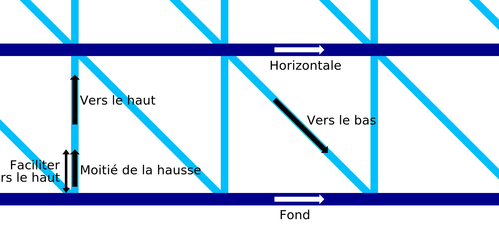

Écart ascendant de l'impression filaire
===

Lorsque l'on commence par le mouvement ascendant du motif en dents de scie reliant les anneaux horizontaux adjacents dans le cadre du mode d'impression par fil, le mouvement ascendant peut être ralenti pour la première partie de la ligne verticale. Ce réglage permet de configurer la partie de la ligne verticale qui sera imprimée plus lentement. Ce segment de la ligne verticale sera imprimé à la moitié de la [vitesse ascendante](./wireframe_printspeed_up.md).

Au lieu de [faire une pause](./wireframe_bottom_delay.md) dans le fond, il est peut-être préférable de laisser la buse en marche. Cela empêche la buse chaude de refondre l'anneau horizontal situé en dessous, mais aura toujours pour effet de pousser fermement le motif en dents de scie sur l'anneau horizontal. La pression à l'intérieur de la chambre de la buse poussera le matériau vers le bas sur l'anneau situé en dessous.

La vitesse à laquelle la buse se déplace pendant cette longueur de fil ne peut pas être configurée séparément. Elle sera toujours égale à la moitié de la vitesse normale.
