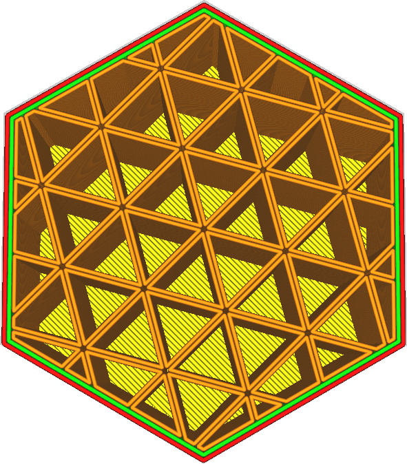
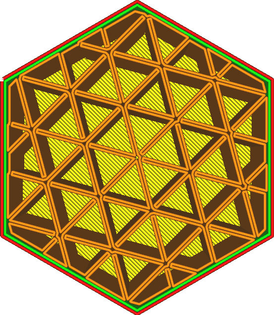

Relier les polygones de remplissage
====
Lorsque le remplissage est constitué de boucles fermées, ces boucles fermées peuvent être fusionnées pour former une seule boucle. Cela permet d'établir de petites connexions là où les polygones sont adjacents.

Ce paramètre n'est disponible que lorsque le remplissage consiste en des boucles adjacentes. Cela signifie que l'un ou l'autre :
* Le [motif de remplissage](infill_pattern.md) est réglé sur Croix ou Croix 3D.
* Les lignes de remplissage sont [multipliées](infill_multiplier.md) par un nombre pair.
* Il y a au moins 2 [murs supplémentaires autour du remplissage](infill_wall_line_count.md).

Le but de cette fonction est d'empêcher les déplacements. La ligne finale sera une seule boucle pour chaque partie connectée du remplissage, de sorte qu'il n'y aura aucun mouvement de déplacement. Il est ainsi plus facile de travailler avec des filaments souples, car ceux-ci sont plus difficiles à rétracter et fonctionnent mieux s'ils peuvent continuer à circuler dans la buse.

La connexion de ces boucles peut également renforcer le matériau de remplissage en améliorant la connexion interne entre les boucles. Cependant, lorsque les polygones sont connectés, la tête d'impression doit souvent faire des tours de 180 degrés juste avant une articulation. Ces tours empêchent parfois le joint d'être complètement connecté. Dans certains cas, cela peut également affaiblir le remplissage. Tout dépend de la façon dont les boucles s'engrènent dans la forme de votre modèle.
