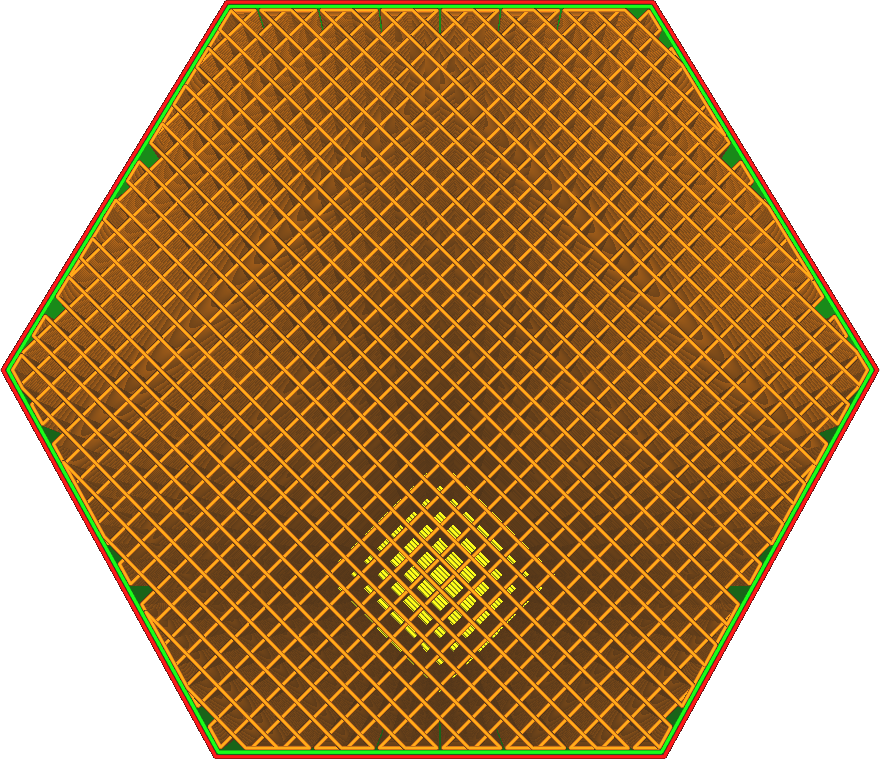
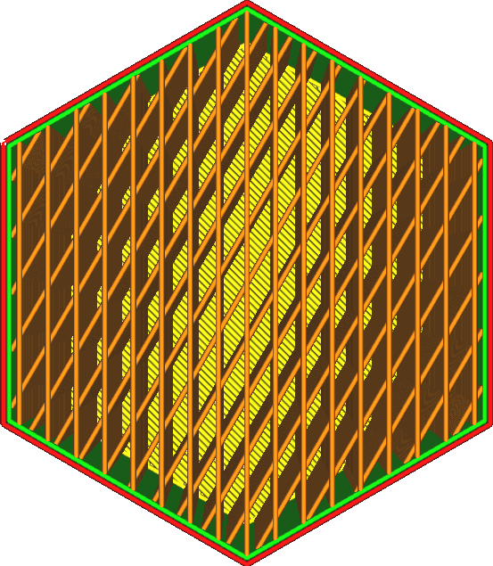

Sens de ligne de remplissage
===

Les lignes de remplissage sont généralement orientées à un angle de 45 degrés autant que possible. À cet angle, les moteurs X et Y travaillent ensemble pour obtenir une accélération maximale de la tête d'impression, lorsque l'on utilise une imprimante avec le mécanisme commun de portique cartésien.

Ce réglage permet d'ajuster cet angle. Vous pouvez le spécialiser pour créer une plus grande force pour votre modèle spécifique, ou obtenir une plus grande accélération pour votre système de portique spécifique (comme pour les imprimantes delta).

La valeur de ce paramètre doit être une liste d'angles séparés par des virgules et entourés de crochets. Un angle de 0 degré donnera une ligne parallèle à l'axe Y. La liste des angles sera alternée sur les couches.
* L'impression finale sera la plus forte dans les directions des lignes de remplissage. Si vous avez besoin que l'impression porte une force spécifique dans une direction horizontale, il est utile d'orienter les lignes de remplissage autour de cette direction.
* Laisser la configuration une liste vide pour utiliser la valeur par défaut.
* La valeur par défaut dépend du modèle de remplissage :
  * Pour les motifs de remplissage en croix et en 3D, la valeur par défaut est [22]. Cela permet d'orienter autant de lignes que possible à proximité des diagonales.
  * Pour les modèles de remplissage en lignes et en zigzag, la valeur par défaut est [45,135]. Cela fait alterner l'orientation couche par couche entre les deux diagonales.
  * Tous les autres motifs utilisent une valeur par défaut de [45]. Cela permet d'orienter autant de lignes que possible à proximité des diagonales.
