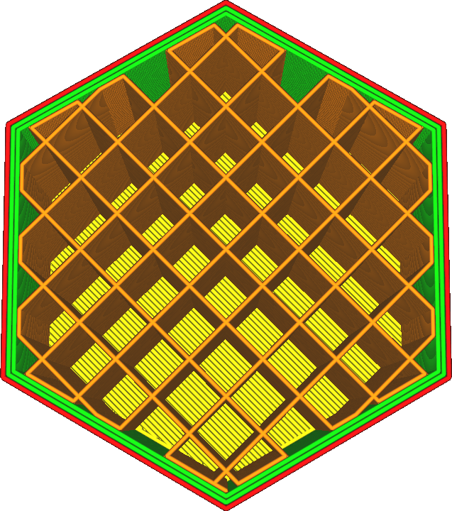
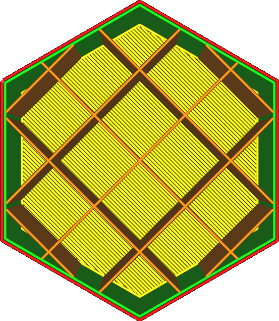

Instead of setting the [Infill Density](infill_sparse_density.md) as a percentage, it is also possible to configure infill density by setting the distance between adjacent infill lines. A greater distance between infill lines will result in a lower infill density overall.

Infill Line Distance is a different way of looking at this property than density. The distance between infill lines gives an indication of the distance that the top surface lines have to cross from one infill line to the next. Reducing the Infill Line Distance thus reduces the bridged distance and improves the quality of top surfaces.

Normally the Infill Line Distance is computed from the desired infill density, depending on the selected infill pattern and line width. The Infill Line Distance is leading.

Increasing the infill density (by reducing the line distance) has a big effect on your print, namely:
* Your print will be stronger.
* The top surface will be supported better, making it smoother and more water tight.
* Reduced pillowing because the pockets of heat will be smaller.
* Your print will require more material and as a result will be heavier.
* It takes longer to print.