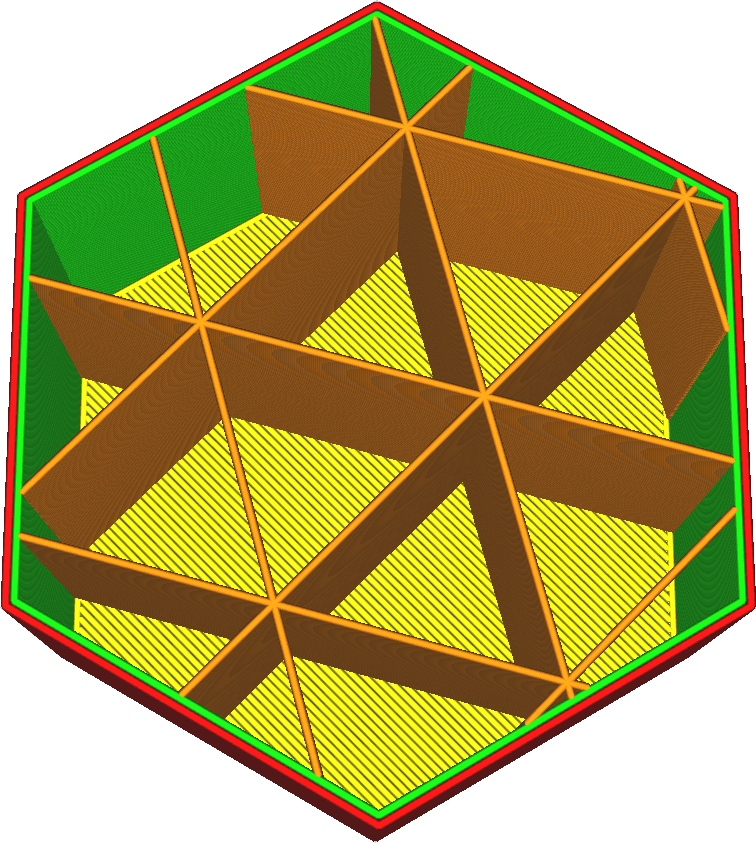

Remplissage Décalage X
===

Normalement, les modèles de remplissage sont centrés sur le centre du modèle 3D. Ce paramètre, ainsi que le [Remplissage Décalage Y](./infill_offset_y.md), permet de déplacer le centre du modèle. Ce paramètre permet d'ajuster la coordonnée X du centre.

Lors de l'impression avec une faible densité de remplissage, vous pouvez l'utiliser pour positionner le remplissage de manière très précise, de sorte que les lignes de remplissage individuelles soient positionnées là où la résistance est la plus nécessaire.
