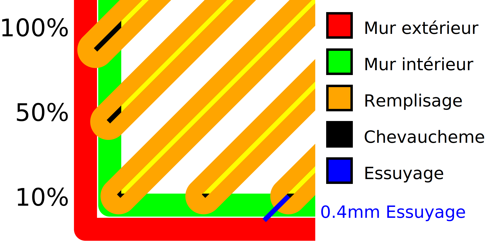

Chevauchement du remplissage
===

Si le remplissage chevauche un peu les murs, il adhérera mieux aux parois, ce qui rendra la pièce beaucoup plus solide. Ce réglage permet de contrôler le degré de chevauchement entre le remplissage et les murs.

* L'augmentation du chevauchement fait que le remplissage adhère mieux aux murs, ce qui donne une partie plus solide.
* Cependant, cela fera également briller le remplissage à travers les murs, ce qui donnera un motif à la surface de l'impression. Cela réduit la qualité visuelle de la surface.
