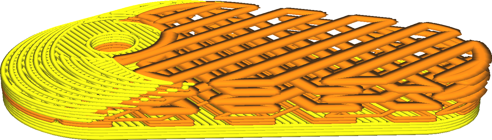

Comme la hauteur de la couche de remplissage n'est pas importante pour la qualité visuelle, vous pouvez utiliser des couches plus épaisses pour le remplissage afin de réduire le temps d'impression. Ce réglage permet de combiner des couches de remplissage, à condition que plusieurs couches de remplissage soient directement superposées. Il n'imprimera alors aucun remplissage sur certaines des couches, mais dans la plus haute des couches combinées, il extrudera plus de matière pour compenser.

Dans la vue des couches, on aura l'impression que les lignes de remplissage sont devenues beaucoup plus larges. Lorsqu'elles sont imprimées, les lignes de remplissage s'abaissent davantage au lieu de s'étendre horizontalement.

L'épaisseur de la couche de remplissage doit être un multiple de la hauteur de la couche ordinaire. Si elle ne l'est pas, elle sera arrondie à la hauteur de couche la plus proche.

* Attention à ne pas trop l'augmenter. Lors du passage à la couche de remplissage et inversement, le débit à travers la buse doit accélérer et décélérer de manière significative. Il y a un certain retard sur ce point, de sorte qu'il y aura trop peu d'extrusion au début du remplissage et trop d'extrusion après la fin du remplissage.
* Dans les couches intermédiaires, il imprimera toujours un remplissage avec une épaisseur de couche plus faible là où il n'y a pas de remplissage dans les couches autour de lui. Cela peut entraîner l'impression de petites lignes de remplissage le long des murs en pente.
